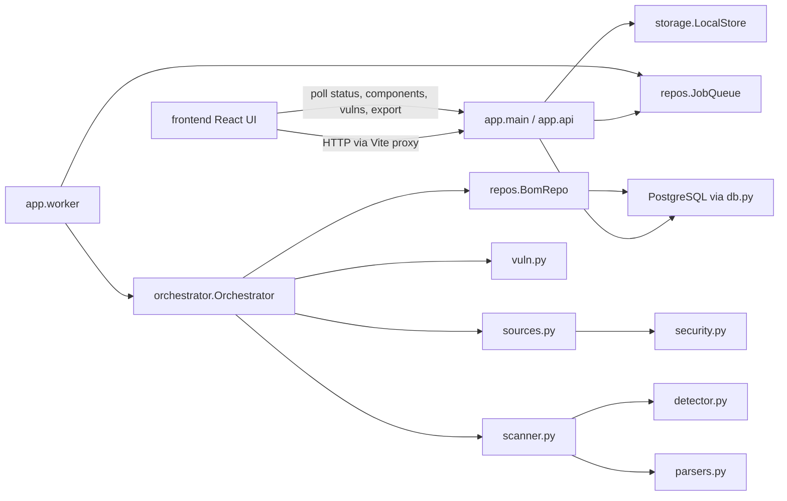

# S-BOM file structure and workflow

S-BOM is an enterprise Software Bill of Materials (SBOM) console. A React UI on port `5173` talks to a Python API on port `8080`. A separate worker process pulls scan jobs from PostgreSQL, reads uploaded files or a GitHub repository, builds a component graph, looks up vulnerabilities, and stores a snapshot the UI can list and export.

This document covers project source and configuration. It does not walk through `frontend/node_modules`, `backend/.venv`, or generated upload blobs under `backend/data`.

## How a scan moves through the system



1. `scripts/dev-all.mjs` starts three processes: the API (`python -m app.main`), the worker (`python -m app.worker`), and the Vite dev server (`npm run dev` in `frontend`).
2. The browser loads `frontend/index.html`, which mounts `frontend/src/main.tsx`.
3. Security Scans calls `startScan` in `AppStateContext`. That context calls `frontend/src/api/client.ts`.
4. Vite proxies `/api` and `/health` to `http://127.0.0.1:8080`.
5. `api.py` writes the upload into local object storage, inserts a `scans` row and a `scan_jobs` row, and returns `202` with a scan id.
6. `worker.py` claims the job with `SELECT ... FOR UPDATE SKIP LOCKED` (inside `JobQueue.claim`).
7. `orchestrator.py` prepares a temp workspace, scans it, correlates CVEs, and saves a BOM snapshot.
8. The UI polls `/api/v1/scans/{id}/status`, then loads components and vulnerabilities into shared React state. Dashboard, inventory, and vulnerability pages read that state.

Organization scope is the request header `X-Organization-Id`. The UI always sends `default`.

## Top-level layout

| Path | Role |
| --- | --- |
| `package.json` | Root scripts. `npm run dev:all` runs `scripts/dev-all.mjs`. |
| `scripts/dev-all.mjs` | Local launcher for API, worker, and UI. |
| `backend/` | Python BOM engine, schema, tests, and Postgres compose file. |
| `frontend/` | React + Vite + Tailwind console. |
| `File_structure_workflow.md` | This document. |

Generated or local-only trees:

| Path | Holds |
| --- | --- |
| `backend/.venv/` | Python virtualenv created by `dev-all`. |
| `backend/data/` | Runtime object store (`data/objects`) and process logs. Gitignored. |
| `backend/.pytest_cache/` | Pytest cache. |
| `frontend/node_modules/` | Installed npm packages. |
| `frontend/tsconfig.tsbuildinfo` | TypeScript incremental build cache. |

---

## Root files

### `package.json`

Private package named `sbom`. The only script is `dev:all`, which starts the full local stack.

### `scripts/dev-all.mjs`

Process supervisor for local development.

What it holds:

- Resolves `backend/.venv` Python (`Scripts/python.exe` on Windows, `bin/python` elsewhere).
- Fills missing environment: `CREDENTIAL_KEK` (random 32 bytes if unset), `DATABASE_URL`, `OBJECT_STORAGE_URL`, `API_ADDR` (`127.0.0.1:8080`), CORS origins for port `5173`, `CREDENTIAL_STORE=env`, `VULN_PROVIDER=mitre`.
- Installs frontend dependencies if `frontend/node_modules` is missing.
- Creates the virtualenv and runs `pip install -r requirements.txt` if needed.
- Stops leftover project processes (`-m app.main`, `-m app.worker`, Vite) that still own ports `8080` and `5173`.
- Spawns API, worker, and `npm run dev`, prefixes their logs, and kills the tree on Ctrl+C.

Connected to: `backend/requirements.txt`, `backend/app/main.py`, `backend/app/worker.py`, `frontend/package.json`.

---

## Backend

### `backend/requirements.txt`

Runtime Python packages:

| Package | Used by |
| --- | --- |
| `fastapi` | `api.py` HTTP app |
| `uvicorn` | `main.py` server |
| `python-multipart` | File uploads |
| `httpx` | GitHub downloads and vulnerability APIs |
| `openpyxl` | Bulk `.xlsx` and XLSX export |
| `cryptography` | AES-GCM credential encryption |
| `psycopg[binary]` | PostgreSQL driver |

### `backend/docker-compose.yml`

One service: Postgres 16 Alpine. User, password, and database are all `sbom`. Host port `5432`. Healthcheck uses `pg_isready`. This matches the default `DATABASE_URL` in `.env.example`. Tests use a separate database name, `sbom_test`, on the same server.

### `backend/.env.example`

Commented template for every runtime setting `config.py` reads. Copy to `backend/.env` for a manual run. `dev-all.mjs` sets the required values itself and does not load this file.

Important keys:

| Variable | Meaning |
| --- | --- |
| `API_ADDR` | Bind address. Default in the example is `:8080`. `dev-all` uses `127.0.0.1:8080`. |
| `API_ALLOW_ORIGINS` | CORS allow-list. |
| `DATABASE_URL` | PostgreSQL DSN. Must start with `postgresql://` or `postgres://`. |
| `OBJECT_STORAGE_URL` | `local://` directory for uploads. Only `local://` is implemented. |
| `CREDENTIAL_STORE` / `CREDENTIAL_KEK` | Dev store encrypts tokens with this key. Required when the store is `env`. |
| `QUEUE_POLL_INTERVAL_MS` | Worker idle wait. |
| `SCANNER_WORKERS` | Threads inside the worker process. |
| `SCAN_TIMEOUT_SECONDS` | Visibility timeout while a job is claimed. |
| `MAX_UPLOAD_SIZE_BYTES` and archive limits | Zip-bomb and size guards used by `security.py`. |
| `GITHUB_API_URL`, `GITHUB_TIMEOUT_SECONDS`, `GITHUB_WEBHOOK_SECRET` | GitHub clone and webhook signature. |
| `VULN_PROVIDER` | `mitre` (default) or `osv`. |
| `MITRE_CVE_API_URL` | Must stay `https://cveawg.mitre.org/api` when the provider is MITRE. |
| `MAX_BULK_ROWS`, `MAX_BULK_FILE_BYTES` | Bulk spreadsheet limits. |
| `LOG_LEVEL` | Uvicorn log level. |

### `backend/.gitignore`

Ignores `data/`, SQLite leftovers, `.env`, `.venv/`, `secrets/`, and Python caches.

### `backend/migrations/001_initial.up.sql`

The only schema file. `db.migrate` runs it on every API and worker start (`CREATE TABLE IF NOT EXISTS`, so it is safe to repeat).

Every tenant-owned table carries `organization_id`.

| Table | What it holds |
| --- | --- |
| `organizations` | Tenant id and name. |
| `users` | User id, org, email, name. Schema only; the API does not manage users. |
| `projects` | Project id, org, name. |
| `applications` | Application id, org, project, name. |
| `scans` | One scan: project, application, version, BOM type, source (`LOCAL` or `GITHUB`), status, stage, error, idempotency key, timestamps, optional bulk row, and the finished `snapshot_id`. |
| `scan_jobs` | Durable queue row: payload JSON, status, attempts (max 3), next attempt time, same idempotency key. |
| `scan_events` | Stage log for a scan (`QUEUED`, `VALIDATING`, `EXTRACTING`, and so on). |
| `bom_snapshots` | Finished SBOM header: repo, commit, scanner name and version, raw metadata. |
| `bom_components` | Packages: name, version, ecosystem, purl, license, supplier, scope, direct flag, source manifest, raw JSON. |
| `bom_dependencies` | Edges between component ids, with a kind such as `runtime`. |
| `git_credentials` | GitHub PAT or GitHub App metadata. The secret is not stored here. |
| `credential_secrets` | AES-GCM nonce and ciphertext, keyed by a secret reference. |
| `repositories` | Saved GitHub URLs per org. |
| `repository_connections` | Link from a repository to a credential, project, and application. |
| `bulk_scans` | Spreadsheet upload summary: filename, row counts, validation errors. |
| `bulk_scan_items` | One row of a bulk file and the child `scan_id`. |
| `vulnerabilities` | Advisory record: CVE id, source, severity, CVSS, description, refs. Unique on `(source, vulnerability_id)`. |
| `component_vulnerabilities` | Link from a component to a vulnerability, plus affected version, fixed version, and status. |
| `exports` | Export job placeholder (format, status, object key). Live export is generated on request and does not require this row. |
| `webhook_events` | GitHub delivery id. Unique on `(provider, delivery_id)` so retries are ignored. |
| `audit_logs` | Actions such as `SCAN_CREATED`, `SCAN_COMPLETED`, `CREDENTIAL_CREATED`. |
| `scanner_versions` | Scanner release catalog. Not written by the current pipeline. |

### `backend/tests/test_local_scan.py`

Integration test against database `sbom_test`. It drops and recreates the `public` schema, builds the FastAPI app, posts a local `package.json` (and related cases), and checks that the API returns components the UI can read. It forces `VULN_PROVIDER=osv` and a fixed `CREDENTIAL_KEK`.

Connected to: `app.api.build`, Postgres, and a temp object directory.

---

## Backend package `backend/app`

`__init__.py` only documents that this package is the Python BOM engine and keeps the same HTTP contract as the original Go API.

### `main.py`

API process entry. Loads config, calls `api.build`, and runs Uvicorn on `cfg.host` / `cfg.port` with a 120-second keep-alive (long uploads and exports).

Connected to: `config.py`, `api.py`.

### `worker.py`

Worker process entry. Calls the same `api.build`, so it opens its own database connection, runs migrations, and builds an `Orchestrator`. It does not serve HTTP. It starts `SCANNER_WORKERS` threads. Each thread:

1. Claims a job.
2. Skips it if the scan is already `CANCELLED`.
3. Calls `orch.execute(job)`.
4. Marks the job complete, cancelled, or failed.
5. Updates in-process counters in `metrics.py`.

Retryable failures schedule `next_attempt` from `orchestrator.backoff_seconds` (5s, then 30s, then exponential, capped at 15 minutes).

Connected to: `api.py` (for `build` only), `config.py`, `metrics.py`, `orchestrator.py`.

### `config.py`

Reads the environment into a frozen `Config` dataclass. `load()` rejects a non-Postgres DSN, a non-`local://` object store, a missing `CREDENTIAL_KEK` when the store is `env`, a non-positive worker count, and a MITRE URL that is not `https://cveawg.mitre.org`.

Properties used elsewhere:

- `postgres_dsn` rewrites `postgres://` to `postgresql://`.
- `object_root` strips the `local://` prefix and keeps Windows drive letters intact.
- `host` and `port` parse `API_ADDR`.

Connected to: every module that receives `Config` (`main`, `worker`, `db`, `storage`, `api`, `orchestrator`).

### `db.py`

Thin PostgreSQL wrapper around one shared `psycopg` connection.

What it holds:

- `Row` and `Result` so callers can use both index and column-name access, plus `fetchone` / `fetchall`.
- `Database.execute` rewrites `?` placeholders to `%s` and serializes access with a re-entrant lock.
- `begin`, `commit`, `rollback` for explicit transactions. The connection itself is in autocommit mode.
- `connect(cfg)` opens the DSN.
- `migrate(db)` reads `migrations/001_initial.up.sql` and executes each statement.
- `finish(db)` commits only if a transaction is still open.

Connected to: `config.py`, the SQL file, and every repository (`repos.py`, `credentials.py`, `api.py`).

### `storage.py`

`LocalStore` writes and reads blobs under `OBJECT_STORAGE_URL`. Keys are `bucket/key` paths. `put`, `get_bytes`, and `open` refuse empty parts, `.`, and `..`. `open_store` resolves a relative root against the process working directory (`backend/` when started by `dev-all`).

Uploads land at `backend/data/objects/uploads/uploads/<org>/<uuid>-<filename>`.

Connected to: `config.py`, `api.py` (write), `orchestrator.py` / `sources.py` (read).

### `metrics.py`

Process-local counters: scans started, succeeded, and failed, duration sum and count, queue depth, worker utilization, GitHub request counters, components discovered, vulnerabilities, and bulk scans. `METRICS.snapshot()` is returned by `/health/ready` and `/metrics.json`. The API process and the worker process each have their own counters. The UI health check hits the API process, so worker counters are not what `/health/ready` shows unless the worker is the process being queried. The worker calls `build()` but does not serve those routes.

### `security.py`

Archive and outbound-network guards.

What it holds:

- `ExtractLimits`: uncompressed size, per-entry size, file count, and max compression ratio.
- `is_blocked_ip` / `assert_safe_host` / `validate_outbound`: block private, loopback, and link-local addresses before GitHub calls.
- `safe_join`: refuse paths that escape the extract directory.
- `extract_zip` and `extract_tar_gz`: extract with those limits.
- `UnsafeArchive` and `UnsafeHost` exceptions.

Connected to: `sources.py` (and the limits object built in `orchestrator.py`).

### `sources.py`

Turns a job payload into a temp directory the scanner can walk.

What it holds:

- `Workspace`: temp parent, extract root, optional Git metadata, and `cleanup()`.
- `prepare_local`: copies the stored object, then unzips, untars, or copies a single manifest.
- `prepare_github`: checks the URL is `https://github.com/{owner}/{repo}`, downloads a tarball through the GitHub API with an optional credential, and extracts it. Uses `_SafeClient` so every request re-checks the host.
- `validate_repo_url`: the URL rules above.
- `is_supported_manifest`, `safe_upload_rel`, `path_skipped`, `pack_folder`: used by the local upload endpoint when the browser sends a folder as many files plus relative paths. Skips `.git`, `node_modules`, `venv`, `dist`, and similar directories. Packs the kept files into a zip.
- `parse_bulk`: reads a `.csv` or `.xlsx`. Blank rows are ignored. Invalid rows and duplicate projects are returned as errors and are not queued. See [Bulk scan row rules](#bulk-scan-row-rules).

`MANIFEST_NAMES` here matches the set the UI filters in `localFolder.ts`.

Connected to: `security.py`, `storage.py`, `credentials.py` (token lookup during GitHub prepare), `api.py`, `orchestrator.py`.

### `detector.py`

Walks a workspace and lists known manifest files. Depth is capped at 30. Files larger than `BOM_MAX_MANIFEST_BYTES` (default 64 MiB) are counted as skipped.

Recognised names and ecosystems:

| File | Kind | Ecosystem |
| --- | --- | --- |
| `package.json` | `NODE_PACKAGE_JSON` | npm |
| `package-lock.json`, `npm-shrinkwrap.json` | npm lock / shrinkwrap | npm |
| `yarn.lock`, `pnpm-lock.yaml` | yarn / pnpm lock | npm |
| `requirements.txt`, `pyproject.toml`, `poetry.lock`, `Pipfile`, `Pipfile.lock` | Python manifests | pypi |
| `pom.xml`, `gradle.lockfile`, `build.gradle`, `build.gradle.kts`, `settings.gradle` | Java | maven |
| `go.mod`, `go.sum` | Go | go |
| `Cargo.toml`, `Cargo.lock` | Rust | cargo |
| `packages.config`, `packages.lock.json`, `*.csproj` | .NET | nuget |
| `composer.json`, `composer.lock` | PHP | composer |
| `Gemfile`, `Gemfile.lock` | Ruby | rubygems |

Always ignored: VCS dirs, build output, IDE dirs, `__pycache__`, and similar. `node_modules`, `venv`, `.venv`, and `vendor` are ignored unless `scan_installed` is true. The live pipeline calls `detect` with the default, so installed trees are skipped.

Connected to: `scanner.py`. `KIND_BY_NAME` is also imported by `parsers.py`.

### `parsers.py`

Turns one detected file into components and dependency edges. `parse_manifest(kind, path, rel)` dispatches on the kind from `detector.py`.

Each parser returns `{ "components": [...], "dependencies": [...] }`. A component dict carries an id, name, version, ecosystem, package manager, purl when one can be built, license, scope, whether it is direct, the source manifest path, and raw fields.

Parsers present:

- npm: `package.json`, npm lock / shrinkwrap, Yarn lock, pnpm lock. Lockfiles also call `_link_lock` to attach dependency edges.
- Python: `requirements.txt`, `pyproject.toml` (PEP 621 and Poetry), `poetry.lock`, `Pipfile`, `Pipfile.lock`.
- Java: `pom.xml`, Gradle lockfile.
- Go: `go.mod` (and the detector also sees `go.sum`).
- Rust: `Cargo.toml`, `Cargo.lock`.
- NuGet: `packages.lock.json`, `packages.config`, `.csproj`.
- PHP: `composer.json`, `composer.lock`.
- Ruby: `Gemfile`, `Gemfile.lock`.

Connected to: `detector.py` (kind names), `scanner.py`.

### `scanner.py`

Builds the in-memory snapshot the rest of the pipeline stores.

`scan_tree(root, scanner_version)`:

1. `detector.detect`
2. `parsers.parse_manifest` for each file (a bad file is recorded in `raw_metadata.parse_errors` and does not fail the scan)
3. `dedupe` by package identity, merging fields with `merge_component`
4. `apply_graph` so dependency edges point at component ids
5. `enrich_local` for licenses and hashes found beside the manifest
6. `audit_compliance` for missing license, missing version, and similar notes

`normalize` runs later from the orchestrator: license aliases in `SPDX_ALIASES`, blank cleanup, and stable fields.

The snapshot dict holds `id`, scanner name and version, `bom_format_version` `1.5`, `generated_at`, `components`, `dependencies`, and `raw_metadata`. The orchestrator then adds org, project, application, repo, and commit fields.

Connected to: `detector.py`, `parsers.py`, `orchestrator.py`.

### `vuln.py`

`VulnProvider.correlate(snap)` attaches advisories to components that have a name, version, and a known ecosystem (`npm`, `pypi`, `maven`, `go`, `cargo`, `nuget`, `composer`, `rubygems`).

- `osv`: posts batches of up to 500 packages to `https://api.osv.dev/v1/querybatch` and keeps OSV records.
- `mitre` (default): uses OSV only to discover CVE ids, then fetches each CVE from `https://cveawg.mitre.org/api/cve/{id}`. Caps: 2000 advisories considered, 250 CVE fetches. Parsed fields include severity, CVSS score and vector, description, and fixed version.

Results are written onto the snapshot (and later into `vulnerabilities` and `component_vulnerabilities` when the snapshot is saved). A correlation failure is recorded as a stage message and does not fail the scan. `METRICS` counts GitHub-unrelated discovery counters from this module as well.

Connected to: `orchestrator.py`, `metrics.py`.

### `export.py`

`export_snapshot(fmt, snap)` returns bytes and a content type.

| Format key | Document |
| --- | --- |
| `cyclonedx-json` | CycloneDX JSON |
| `spdx-json` | SPDX JSON |
| `csv` | Component and vulnerability rows |
| `xlsx` | Workbook with the same rows, via openpyxl |

`EXPORTERS` is the allow-list returned by `/health/ready` and checked by the export routes.

Connected to: `api.py`. It does not talk to the database. The API loads the snapshot first.

### `credentials.py`

Two stores plus an audit writer.

- `CredentialStore`: AES-GCM encrypt and decrypt using `CREDENTIAL_KEK`. Rows go in `credential_secrets`.
- `Credentials`: `create_pat`, `create_app`, `list`, `revoke`, `resolve`. Public rows go in `git_credentials`. `resolve` returns the decrypted token for a GitHub download.
- `Audit.record`: inserts `audit_logs`.

Connected to: `db.py`, `repos.py` (`iso`, `utcnow`), `api.py`, `orchestrator.py`.

### `repos.py`

SQL access for scans, the job queue, and BOM snapshots.

`ScanRepo` methods: `create_scan`, `get_scan`, `find_by_key`, `list_scans`, `set_stage`, `mark_running`, `mark_completed`, `mark_failed`, `mark_cancelled`, `reopen`, `reset_for_rescan`, `record_event`, `list_events`. `public_scan` strips internal fields before a list response.

`JobQueue` methods: `enqueue`, `claim` (skip locked, set `RUNNING`, bump attempts), `complete`, `fail` (retry or dead-letter), `mark_cancelled`, `requeue`, `requeue_failed`, `get_for_scan`.

`BomRepo.save_snapshot` writes `bom_snapshots`, `bom_components`, `bom_dependencies`, vulnerability rows, and component links in one transaction. It drops prior snapshots for that scan on rescan, and it skips package versions the organization already stored (`components_skipped` on the snapshot). `get_snapshot` reloads the graph. `list_for_application` lists snapshot headers.

Helpers: `utcnow`, `iso`, `_package_key` (ecosystem, name, version).

Connected to: `db.py`. Used by `api.py` and `orchestrator.py`.

### `orchestrator.py`

Owns scan lifecycle after the HTTP layer has a payload.

`Orchestrator.create_scan`:

- Allows only `bom_type=SBOM` and `source_type` `LOCAL` or `GITHUB`.
- Builds an idempotency key from org, application, source, repo URL, branch, commit, upload hash, and scanner version.
- If that key already exists and the scan failed, was dead-lettered, or was cancelled, it reopens and requeues it.
- Otherwise it inserts the scan and enqueues a job, then writes `SCAN_CREATED`.

`rescan` is allowed from `COMPLETED`, `FAILED`, `DEAD_LETTER`, or `CANCELLED`. `cancel` is allowed while the scan is `PENDING`, `QUEUED`, or `RUNNING`.

`execute` stages, recorded both as `scans.stage` and as `scan_events`:

| Stage | Work |
| --- | --- |
| `VALIDATING` | Scan is active. |
| `EXTRACTING` | `prepare_local` or `prepare_github`. |
| `DETECTING_MANIFESTS` | `scanner.scan_tree`. |
| `NORMALIZING` | `scanner.normalize`. |
| `ANALYZING_VULNERABILITIES` | `vulns.correlate`. Failure is logged and the scan continues. |
| `GENERATING_SBOM` | `boms.save_snapshot`. A database error is retryable. |
| `COMPLETED` or `FAILED` | Status update and audit row. |

The temp workspace is always deleted in a `finally` block. Cancellation checks run between stages.

Also holds `RetryableError`, `TerminalError`, `RescanError`, `CancelError`, `ScanCancelled`, `backoff_seconds`, and `stable_config_digest`.

Connected to: `scanner.py`, `config.py`, `credentials.py`, `metrics.py`, `repos.py`, `security.py`, `sources.py`, `storage.py`, `vuln.py`.

### `api.py`

Builds the FastAPI app and every HTTP route. `build()` wires the process:

`connect` → `migrate` → `open_store` → `CredentialStore` / `Credentials` / `Audit` → `ScanRepo` / `BomRepo` / `JobQueue` → `VulnProvider` → `Orchestrator`.

Those objects live on `app.state`. CORS is added when `API_ALLOW_ORIGINS` is set. Every response gets an `X-Request-Id`. JSON bodies use an envelope: `{ success, data }` or `{ success: false, error: { code, message } }`.

| Method and path | What it does |
| --- | --- |
| `GET /health/live` | Liveness. |
| `GET /health/ready` | Database dialect, metrics, scanner version, exporter list. |
| `GET /metrics.json` | Counter snapshot. |
| `POST /api/v1/scans/local` | One file, a zip / tar.gz, or a folder (`files` + `paths`). Requires `application_name`. Stores the blob and creates a `LOCAL` scan. Returns `202`. |
| `POST /api/v1/scans/github` | JSON body with repository URL, project, application, version, branch, optional credential id. |
| `GET /api/v1/scans` | Scans for the caller's org. |
| `GET /api/v1/scans/{id}` | One scan. |
| `GET /api/v1/scans/{id}/status` | Status, stage, error. |
| `POST /api/v1/scans/{id}/rescan` | Requeue. |
| `POST /api/v1/scans/{id}/cancel` | Cancel in-progress work. |
| `GET /api/v1/scans/{id}/events` | Stage log. |
| `GET /api/v1/scans/{id}/sbom` | Snapshot for the scan. |
| `GET /api/v1/scans/{id}/components` | Component rows. |
| `GET /api/v1/scans/{id}/dependencies` | Dependency edges. |
| `GET /api/v1/scans/{id}/vulnerabilities` | Matches for the snapshot. |
| `GET /api/v1/scans/{id}/export?format=` | CycloneDX, SPDX, CSV, or XLSX bytes. |
| `GET /api/v1/boms/{id}` and `.../export` | Same data addressed by snapshot id. |
| `GET /api/v1/applications/{id}/boms` | Snapshots for one application in the org. |
| `POST /api/v1/scans/bulk` | CSV or XLSX of GitHub rows. Valid rows are queued. Duplicate projects and invalid rows are skipped. |
| `GET /api/v1/bulk-scans/{id}` and `.../results` | Bulk aggregate and per-row status. |
| `POST /api/v1/credentials/github` | Store a fine-grained PAT or a GitHub App key. |
| `GET /api/v1/credentials/github` | List credentials. Secrets are not returned. |
| `DELETE /api/v1/credentials/github/{id}` | Revoke. |
| `POST /api/v1/github/webhooks` | Verifies `X-Hub-Signature-256`, stores the delivery, and on `push` or `release` queues a GitHub scan. |

`_org` reads `X-Organization-Id` and falls back to `default`.

Connected to: every backend module listed above except `detector.py`, `parsers.py`, and `scanner.py`, which it reaches only through `Orchestrator`.

### Bulk scan row rules

`parse_bulk` in `sources.py` and `_submit_bulk` in `api.py` apply these rules. The CSV preview in `frontend/src/pages/bulkRows.ts` uses the same file rules before launch. A match against a scan that already exists is decided only on the server.

The whole file is rejected, and no bulk scan is stored, when:

- the upload is not `.csv` or `.xlsx`
- the file is empty or has no data rows
- a required column is missing: `project_name`, `application_name`, `version`, `repository_url`
- the file exceeds `MAX_BULK_FILE_BYTES` or the data-row count exceeds `MAX_BULK_ROWS`

Blank rows are ignored. They are not data rows and they are not invalid rows.

A data row is **invalid** when any of these is true:

| Code | When |
| --- | --- |
| `MISSING_PROJECT_NAME` | `project_name` is blank |
| `MISSING_APPLICATION_NAME` | `application_name` is blank |
| `MISSING_REPOSITORY_URL` | `repository_url` is blank |
| `INVALID_GITHUB_URL` | the URL is not `https://github.com/{owner}/{repo}` |
| `UNSUPPORTED_SCAN_TYPE` | `scan_type` is set and is not `GITHUB` |

`version` and `branch` may be blank. A blank version is stored as `UNKNOWN`. A blank branch lets GitHub use the repository default. One row can have several of these errors. The row is still one invalid row.

A **duplicate project** is a later data row whose GitHub repository and branch match an earlier row that will be scanned. Owner and repository are compared without case, and a trailing `.git` does not make a second project. The branch is compared exactly, so `main` and `Main` are different. The same project name with a different repository or branch is a different project and is scanned.

| Code | When |
| --- | --- |
| `DUPLICATE_PROJECT` | This file already has a valid row for that repository and branch. The message names the first row. |
| `DUPLICATE_PROJECT` | This organization already has a scan for the same application, repository, and branch. That scan is kept. If the earlier scan failed, was dead-lettered, or was cancelled, it is reopened instead of skipped. |

What happens to those rows:

- The first valid row for a repository and branch is queued as its own GitHub scan.
- Invalid rows and duplicate projects are stored on `bulk_scan_items` with status `SKIPPED`, plus `error_code` and `error_message`. They do not get a new scan id.
- Other rows in the file are still queued.
- `total_rows` is the number of non-blank data rows. `invalid_rows` is the number of rows that were not queued. `queued_rows` is the number that were.
- `validation_errors` lists every problem. A row with three missing fields counts once in `invalid_rows` and three times in that list.
- If nothing was queued, the bulk scan status is `FAILED`. If some rows are queued and some are skipped, it stays `PROCESSING` until the queued scans finish, then `COMPLETED` or `COMPLETED_WITH_ERRORS`.

The Security Scans matrix marks each CSV row Ready, Duplicate, or Invalid before launch. `.xlsx` files are classified when the API accepts them. The result toast states how many rows were queued, how many duplicate projects were skipped, and how many invalid rows were skipped.

---

## Frontend

### Tooling

| File | What it holds |
| --- | --- |
| `frontend/package.json` | App `squad1-sbom`. Scripts: `dev` (Vite), `dev:all` (same launcher as the repo root), `build` (`tsc -b` then `vite build`), `preview`. Dependencies: React 18, React Router 6, Recharts, Lucide icons, `clsx`, `tailwind-merge`. |
| `frontend/package-lock.json` | Locked npm tree. |
| `frontend/index.html` | Shell. Title, Inter and JetBrains Mono, favicon `/squad1-shield.png`, and `<div id="root">`. Loads `/src/main.tsx`. |
| `frontend/vite.config.ts` | React plugin. Dev server on `127.0.0.1:5173`. Proxies `/api` and `/health` to `127.0.0.1:8080` with a 30-minute timeout so large scans and uploads are not cut off. |
| `frontend/tsconfig.json` | Strict TypeScript, `jsx: react-jsx`, includes `src` only. |
| `frontend/postcss.config.js` | Tailwind and Autoprefixer. |
| `frontend/tailwind.config.js` | Scans `index.html` and `src/**/*.{js,ts,jsx,tsx}`. Class-based dark mode. Brand blue scale, Inter and JetBrains Mono, card shadows. |
| `frontend/.gitignore` | `node_modules`, `dist`, logs, editor files, `*.tsbuildinfo`. |
| `frontend/UI_Remap.md` | UI spec for the sidebar and page split: what to show now versus later. It is a design note, not runtime code. |
| `frontend/screenshot.png` | Reference screenshot used with that spec. |
| `frontend/public/squad1-logo.png` | Wordmark. |
| `frontend/public/squad1-shield.png` | Favicon and shield mark. |
| `frontend/public/squad1-text.png` | Text lockup. |

### `frontend/src/main.tsx`

React root. Renders `<App />` in `StrictMode` and imports `index.css`.

### `frontend/src/index.css`

Tailwind layers, page background variables, dark background, and thin scrollbars.

### `frontend/src/vite-env.d.ts`

Vite client types, plus modules for `.png`, `.jpg`, and `.svg` imports.

### `frontend/src/App.tsx`

Provider and route table. Order is `ThemeProvider` → `AppStateProvider` → `BrowserRouter` → `Layout` → `Routes`.

| Path | Page |
| --- | --- |
| `/` | Redirects to `/dashboard` |
| `/dashboard` | `Dashboard` |
| `/security-scans` and `/security-scans/:tab` | `SecurityScans` |
| `/software-inventory`, `/software-inventory/components` | `SoftwareInventory` |
| `/software-inventory/add` | `AddInventoryComponent` |
| `/software-inventory/projects` | `ProjectsMicroservices` |
| `/software-inventory/artifacts` | `SBOMArtifacts` |
| `/vulnerabilities` | `Vulnerabilities` |
| `/remediation` | `Remediation` |
| `/compliance` | `Compliance` |
| `/export-center` | `ExportCenter` |
| `/policies` | `Policies` |
| `/supply-chain` | `SupplyChain` |
| `/monitoring` | `Monitoring` |
| `/integrations` | `Integrations` |
| `/profile` | `Profile` |
| `/users` | `Users` |
| `/settings` | `Settings` |
| anything else | Redirects to `/dashboard` |

`/users` and `/settings` are routed but commented out of the sidebar.

### `frontend/src/types/index.ts`

Shared TypeScript types. These are UI shapes, not the raw API JSON.

| Type | Meaning |
| --- | --- |
| `Severity`, `Ecosystem`, `ScanStatus`, `LicenseType`, `VexStatus`, `ComplianceStatus` | Closed unions used by badges and tables. |
| `Project` | Inventory project card: risk, compliance, counts, repo, status. |
| `Vulnerability` | CVE row: package, CVSS, EPSS, status, fix version, description, VEX. |
| `SBOMComponent` | Package row: license, purl, risk, CVE count, direct flag, supplier. |
| `RemediationTicket` | Ticket board item. Held in React state, not in Postgres. |
| `PolicyRule` | Policy card. Toggled in React state. |
| `ComplianceFramework` | Framework score card. |
| `TimelineEvent` | Notification feed item. |
| `ScanJob` | One scan as the UI shows it: progress, counts, log lines. |
| `UserAccount` | Users page row. |
| `IntegrationService`, `RiskHeatmapRow`, `SBOMCoverageData` | Supporting dashboard and integration shapes. |

`client.ts` maps API scans, components, and vulnerability matches into `ScanJob`, `SBOMComponent`, and `Vulnerability`.

### `frontend/src/api/client.ts`

The only HTTP client. `BASE` is `VITE_API_BASE` or empty, so dev traffic stays same-origin and Vite proxies it.

`request()` sets `X-Organization-Id: default`, parses the `{ success, data, error }` envelope, and throws `ApiError`.

Calls:

| Function | Backend route |
| --- | --- |
| `healthReady` | `GET /health/ready` |
| `listScans` | `GET /api/v1/scans` |
| `scanStatus` | `GET /api/v1/scans/{id}/status` |
| `rescanScan` / `cancelScan` | `POST .../rescan` and `.../cancel` |
| `scanEvents` | `GET .../events` |
| `scanComponents` | `GET .../components` |
| `scanVulnerabilities` | `GET .../vulnerabilities` |
| `createLocalScan` | `POST /api/v1/scans/local` as multipart (`file`, or `files` + `paths`) |
| `createGitHubScan` | `POST /api/v1/scans/github` |
| `createBulkScan` | `POST /api/v1/scans/bulk` |
| `createGitHubPat` | `POST /api/v1/credentials/github` |
| `scanPackageTotals` | components + vulnerabilities, then counts critical and high |
| `exportUrl` | builds `GET .../export?format=` |

Mappers: `mapScan`, `mapStatus`, `progressFor` (stage name to a percent), `mapComponent`, `mapVulns`. Ecosystem strings from the scanner (`npm`, `pypi`, `maven`, …) are translated into the UI `Ecosystem` union.

Connected to: `types/index.ts`, `AppStateContext.tsx`, and `SecurityScans.tsx` (package totals).

### `frontend/src/data/mockData.ts`

Initial values for React state. Projects, vulnerabilities, components, tickets, policies, frameworks, timeline events, scans, and users start as empty arrays. `initialIntegrations` holds the static integration catalog (names, categories, descriptions) shown before any live connection exists. Chart series for license mix, vulnerability trend, risk heatmap, and SBOM coverage also start empty so the dashboard fills from scan results.

Connected to: `AppStateContext.tsx` and `Compliance.tsx`.

### `frontend/src/context/ThemeContext.tsx`

`light` or `dark`, stored in `localStorage` under the theme key, applied as the `dark` class on `document.documentElement`. `useTheme()` is what the header uses to toggle.

### `frontend/src/context/AppStateContext.tsx`

Shared application state. This is the bridge between the API and every page.

On mount it calls `healthReady` and `listScans`. A successful health check marks the scan API and Postgres as connected. Completed scans are expanded with `scanPackageTotals`, then `loadScanResults` merges components and vulnerabilities into state. Duplicate packages are merged by name, version, and ecosystem. Vulnerability severity updates each component's risk.

Actions that hit the API:

- `startScan` — local file or folder, GitHub URL (optional PAT stored first), or bulk spreadsheet.
- `watchScan` — polls status until completed, failed, or cancelled, then loads results.
- `rescanScan` / `cancelScan`.
- `exportSBOM` — if a latest scan id exists and the format is not `json`, downloads SPDX, CycloneDX, or CSV from the API. The JSON branch builds a file from in-memory components.

Actions that stay in the browser:

- `addProject`, `addComponent`, `updateTicketStatus`, `togglePolicy`.
- Modal flags: search, add project, add dependency, vulnerability drawer, notifications, user menu.
- `toasts`.
- `triggerSelfHeal` — a timed UI status animation. It does not call the backend.

`useAppState()` throws if a component is rendered outside the provider.

Connected to: `api/client.ts`, `mockData.ts`, `types/index.ts`, and the pages and chrome listed below.

### `frontend/src/pages/localFolder.ts`

Browser-side folder picker helper used by Security Scans. Walks a dropped directory (`DataTransfer` entries), skips the same directories as `sources.py` (`node_modules`, `venv`, `dist`, …), and keeps only manifest paths that match `MANIFEST_NAMES` plus `.csproj` / `.vbproj` / `.fsproj`.

Exports: `FolderFile`, `isManifestRelativePath`, `isInsideSkippedDir`, `selectFolderManifests`, `folderLabel`, `filesFromDataTransfer`.

Connected to: `SecurityScans.tsx`. The filtered file list is what `createLocalScan` uploads as `files` and `paths`.

### `frontend/src/pages/bulkRows.ts`

CSV preview of the bulk-scan rules. `classifyBulkCsv` marks each data row `ready`, `duplicate`, or `invalid` using the same column names, GitHub URL shape, and repository-plus-branch identity as `parse_bulk`. A duplicate project message names the first spreadsheet row. This preview cannot see scans that already exist in PostgreSQL; the API reports those after launch.

Connected to: `SecurityScans.tsx`.

---

## Frontend layout

### `components/layout/Layout.tsx`

Page chrome: `Sidebar`, offset main column, `TopHeader`, then the route's children. Also mounts the global search modal, add-project modal, add-dependency modal, vulnerability drawer, and toast container so they exist on every route.

### `components/layout/Sidebar.tsx`

Hover-expand navigation. Items and routes:

Dashboard, Security Scans, Export Center, Software Inventory, Vulnerability Management, Remediation Tickets, Regulatory Compliance, Security Policies, Supply Chain, Continuous Monitoring, Enterprise Integrations. Users and Settings are present in `App.tsx` but commented out here.

Uses `Squad1Logo` and Lucide icons. `SidebarIcons.tsx` still holds the older custom SVG set (`DashboardIcon`, `AssessmentsIcon`, and others) and is not what the current sidebar renders.

### `components/layout/Squad1Logo.tsx`

Logo mark. Collapsed mode shows the shield; expanded mode shows the wider lockup. Reads images from `frontend/public`.

### `components/layout/TopHeader.tsx`

Sticky header: theme toggle (`ThemeContext`), search opener, notification bell, user menu. Reads those flags from `AppStateContext`.

### `components/layout/SidebarIcons.tsx`

Unused-by-sidebar SVG icon components kept from an earlier nav design.

---

## Frontend shared components

All of these read `useAppState` unless noted.

| File | What it holds |
| --- | --- |
| `components/common/Badge.tsx` | `Badge`, `SeverityBadge`, `EcosystemBadge`, `VexBadge`. Presentational. Uses types from `types/index.ts`. |
| `components/common/StatCard.tsx` | Label, value, and trend tile used on dashboard-style pages. Presentational. |
| `components/common/Toast.tsx` | Renders `toasts` and calls `removeToast`. |
| `components/common/GlobalSearchModal.tsx` | Search box over `components`, `vulnerabilities`, and `projects`. Can open the vulnerability drawer. |
| `components/common/AddProjectModal.tsx` | Form that calls `addProject` (in-memory). |
| `components/common/AddDependencyModal.tsx` | Form that calls `addComponent` (in-memory). |
| `components/common/VulnerabilityDrawer.tsx` | Side panel for `selectedVulnerability`. |
| `components/common/NotificationPanel.tsx` | Slide-over list of `timelineEvents`. |
| `components/common/UserMenuModal.tsx` | Account menu. Opens toasts for actions that are not wired to a user API. |

---

## Frontend pages

Pages that show live scan data do it through `AppStateContext`, which already loaded the API. Only Security Scans starts new backend work.

| File | What the page holds | Data source |
| --- | --- | --- |
| `pages/Dashboard.tsx` | Risk summary, project and vulnerability charts (Recharts). | `projects` and `vulnerabilities` from context. |
| `pages/SecurityScans.tsx` | New scan (local file, local folder, GitHub, bulk), live job, history. Calls `startScan`, `rescanScan`, `cancelScan`, `exportSBOM`. Also calls `scanPackageTotals` directly. Folder selection uses `localFolder.ts`. Bulk CSV preview uses `bulkRows.ts`. | API through context. |
| `pages/SoftwareInventory.tsx` | Component table, filters, CSV export of the table, opens the add-dependency modal. | `components` and `projects` from context. `addComponent` is local. |
| `pages/AddInventoryComponent.tsx` | Manual component form. | `addComponent` in context. Not sent to the API. |
| `pages/ProjectsMicroservices.tsx` | Project and service table with its own CSV export. | Mostly page-local presentation plus toasts. |
| `pages/SBOMArtifacts.tsx` | Artifact list and client-side file download helpers. | Toasts from context. Artifact rows are page-local. |
| `pages/Vulnerabilities.tsx` | CVE table. Row click sets `selectedVulnerability`, which opens the drawer in `Layout`. | `vulnerabilities` from context (filled by completed scans). |
| `pages/Remediation.tsx` | Ticket board. Status changes call `updateTicketStatus`. | `tickets` in React state. The ticket table in Postgres does not exist. |
| `pages/ExportCenter.tsx` | Export actions over the current inventory. | `projects`, `components`, `vulnerabilities`. Server-side SPDX, CycloneDX, and CSV download is `exportSBOM` from Security Scans, which uses the latest scan id. |
| `pages/Compliance.tsx` | Framework cards. | `initialComplianceFrameworks` from `mockData.ts` (empty) plus toasts. |
| `pages/Policies.tsx` | Policy list UI. | Toasts. `togglePolicy` exists on context; this page's rules are largely local. |
| `pages/SupplyChain.tsx` | Provenance view. | Toasts. No backend provenance route. |
| `pages/Monitoring.tsx` | Monitoring dashboard. | Toasts. Does not read worker metrics. |
| `pages/Integrations.tsx` | Catalog of SCM, CI, containers, trackers, and chat, with connect buttons. | Static definitions in the page plus toasts. GitHub scanning itself is the Security Scans form, not this page. |
| `pages/Profile.tsx` | Profile form. | Toasts only. |
| `pages/Users.tsx` | User table. | `users` from context, which stays at the empty `initialUsers` list. |
| `pages/Settings.tsx` | Organization settings form. | Toasts only. |

---

## Connection map

```text
index.html
  -> main.tsx
       -> App.tsx
            -> ThemeContext.tsx
            -> AppStateContext.tsx
                 -> api/client.ts  ----HTTP---->  api.py
                 -> data/mockData.ts
                 -> types/index.ts
            -> Layout.tsx
                 -> Sidebar.tsx -> Squad1Logo.tsx -> public/*.png
                 -> TopHeader.tsx -> ThemeContext + AppStateContext
                 -> modals, drawer, toasts

api.py
  -> config.py          (environment)
  -> db.py              -> migrations/001_initial.up.sql -> PostgreSQL
  -> storage.py         -> backend/data/objects
  -> credentials.py     -> git_credentials + credential_secrets
  -> repos.py           -> scans, scan_jobs, scan_events, bom_*
  -> orchestrator.py
       -> sources.py -> security.py
       -> scanner.py -> detector.py
                     -> parsers.py
       -> vuln.py        (OSV and MITRE over HTTPS)
       -> repos.BomRepo
  -> export.py          (bytes returned by the export routes)

worker.py
  -> api.build()        (same wiring, no HTTP server)
  -> orchestrator.execute
  -> metrics.py

dev-all.mjs
  -> app.main, app.worker, frontend vite
  -> docker-compose.yml Postgres is expected to be running already
```

## What is stored where

| Concern | Where it lives |
| --- | --- |
| Uploaded zip, folder pack, or manifest | `backend/data/objects` via `storage.py`. The job payload stores the object key and SHA-256. |
| Scan status and stage log | `scans` and `scan_events`. |
| Work queue | `scan_jobs`. |
| Packages, edges, CVEs | `bom_snapshots`, `bom_components`, `bom_dependencies`, `vulnerabilities`, `component_vulnerabilities`. |
| GitHub tokens | Ciphertext in `credential_secrets`. Metadata in `git_credentials`. |
| Audit trail | `audit_logs`. |
| UI tickets, policies, manual components | React state in `AppStateContext`. A refresh reloads scans from the API and rebuilds components and vulnerabilities. Manual tickets and manually added components are not in the database. |
| Theme | `localStorage` in the browser. |
