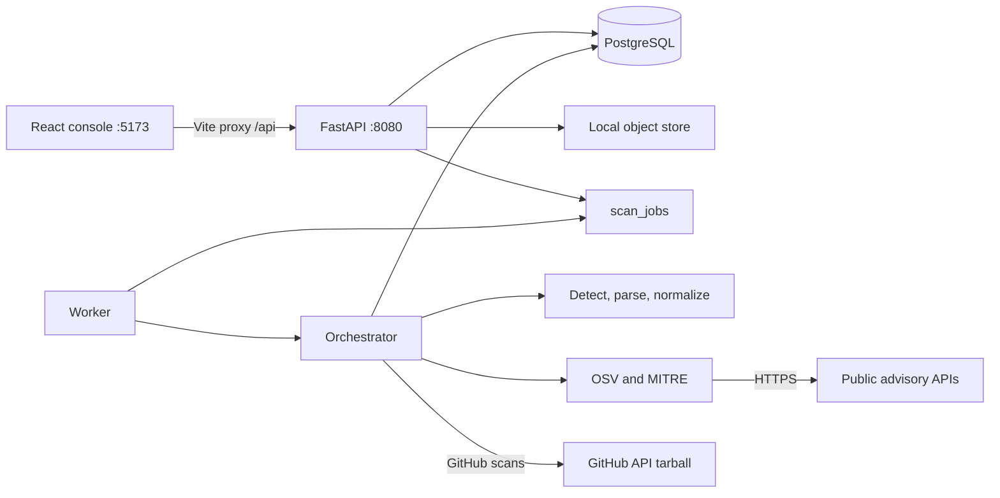

# S-BOM

This document answers what an SBOM is, why a company needs one, how the process works, where the market gap for automation sits, and how this repository implements that process. Statements about the product are taken from the running design in this codebase (`project_workflow.md`, `backend/app`, and the React console).

---

## 1. What is SBOM?

**SBOM** means **Software Bill of Materials**.

It is a structured inventory of the software that makes up an application: the application itself, the libraries it declares, the libraries those libraries pull in, and the identity of each piece (name, version, ecosystem, license, and a stable identifier). Think of it as the ingredients list and the recipe graph for a product, not a marketing description of the product.

A useful SBOM is not a folder listing and not a screenshot of `package.json`. It is a **snapshot** with three layers:

| Layer | What it records | In this product |
| --- | --- | --- |
| Identity | Who built the document, when, for which application and version | `bom_snapshots`: organization, project, application, version, scanner name/version, timestamp, optional Git commit |
| Components | Each package: name, version, ecosystem, license, scope, direct vs transitive, package URL | `bom_components` |
| Relationships | Which component depends on which | `bom_dependencies` (edges between component ids on the same snapshot) |

Two interchange formats matter in procurement and regulation:

- **CycloneDX 1.5 JSON** (`bomFormat`, `specVersion`, components, dependency graph). Produced by `backend/app/export.py`.
- **SPDX 2.3 JSON** (packages, `DEPENDS_ON` / `DESCRIBES` relationships, purl as an external reference). Same exporter.

This engine also emits **CSV** and **XLSX** so security, legal, and audit teams can read the same snapshot without a specialized parser.

Each component is identified, when possible, by a **purl** (package URL), for example `pkg:npm/lodash@4.17.21`. If the parser did not already supply one, `scanner.normalize` builds `pkg:{ecosystem}/{name}@{version}`. A purl is what lets a vulnerability database, a license policy, and a customer questionnaire all point at the same library.

### What this product treats as an SBOM

S-BOM is an enterprise console around that inventory. An operator supplies source (a folder, an archive, or a GitHub repository). The platform:

1. Builds a component graph from recognized manifests and lockfiles.
2. Correlates known vulnerabilities (OSV, optionally enriched from MITRE).
3. Stores a snapshot in PostgreSQL.
4. Lets the team inventory packages, triage CVEs, and export standard formats.

The scanner records a small **NTIA minimum-elements** check on each component (`scanner.audit_compliance`): supplier, name, version, unique identifier (purl or CPE), dependency relationship, document author, and timestamp. That is the baseline US federal buyers have used since Executive Order 14028 to decide whether an SBOM is complete enough to accept.

### What an SBOM is not, in this codebase

- It is not a full source-code audit. The scanner reads manifests and lockfiles. It does not decompile binaries or scan container images.
- It is not the vulnerability database itself. CVEs are a correlation layered on top of the inventory (`vulnerabilities` and `component_vulnerabilities`).
- It is not a ticket system. Remediation boards in the UI are local React state until a tickets API exists.

---

## 2. Why SBOM is needed in a corporation

Modern products are mostly other people’s code. A typical service declares a handful of direct dependencies and inherits hundreds of transitive ones across npm, PyPI, Maven, Go, .NET, PHP, Ruby, and Rust. Nobody in the company typed most of those names. Without an SBOM, the company cannot answer basic questions that legal, security, customers, and regulators now ask.

### Operational reasons

| Question the business must answer | Without an SBOM | With a stored snapshot |
| --- | --- | --- |
| Where is Log4j / a given CVE used? | Manual search across repos, often incomplete | Inventory and vulnerability views keyed by package and purl |
| Which version is running, and is there a fix? | Tribal knowledge | Component version plus `fixed_version` from advisory correlation |
| What did we ship to this customer last quarter? | A git tag, if anyone remembers it | A snapshot tied to application version, repo URL, and commit SHA |
| Did a new commit change the dependency set? | Diffing lockfiles by hand | Rescan or webhook-triggered GitHub scan produces a new snapshot |

A corporation has many applications, many teams, and many languages. The unit of risk is the **organization**, not one developer’s laptop. This product scopes every request with `X-Organization-Id` and stores tenant-owned rows (`organization_id` on scans, projects, credentials, and bulk jobs).

### Risk reasons

- **Known vulnerabilities.** A library version maps to public advisories. The worker queries OSV (`https://api.osv.dev/v1/querybatch`) and, in MITRE mode, pulls CVE records so severity and CVSS sit next to the package.
- **License exposure.** GPL in a distributed product, or an unknown license, is a legal problem. Parsers capture declared licenses; `normalize_license` aliases common names (for example “mit license” → `MIT`) and can fall back to a `LICENSE` file in the tree.
- **Supplier and integrity.** NTIA fields (supplier, purl, hashes when the lockfile has them) are what a customer security review asks for. The Supply Chain module is designed to show pedigree; signature and SLSA attestation ingest are still planned, not live.
- **Blast radius.** Dependency edges answer “if this package is bad, which applications inherit it?” Edges are stored; org-wide used-by counts are a later inventory feature.

### Regulatory and customer reasons

Buyers and regimes increasingly require an SBOM as evidence, not as a nice-to-have:

- **US federal procurement** (EO 14028, NTIA minimum elements, and agency supplements): name, version, supplier, identifier, relationships, author, timestamp.
- **EU Cyber Resilience Act** and similar product-security rules: manufacturers must know the components in a product and be able to handle vulnerabilities in them.
- **Customer questionnaires and SOC / ISO evidence packs:** “send the SBOM and the open CVE list for this release.”
- **India CERT-In style incident and software-composition expectations** are called out in the compliance module design as a scorecard the product intends to prove, not only as a download button.

The console splits two jobs on purpose:

- **Export Center** — produce the file (CycloneDX, SPDX, CSV, XLSX) from a stored snapshot.
- **Regulatory Compliance** — show whether required attributes are present and package evidence. Scorecards are still a UI shell; the honest coverage signal that exists today is the per-component NTIA status written during the scan.

### Why “we use GitHub and Dependabot” is not the same thing

A single forge’s alert is per repository and per ecosystem the forge understands. A corporation still needs:

- One inventory across **local code that is not on that forge**, archived releases, and many repos.
- A **standard document** a customer or regulator will accept (CycloneDX / SPDX), not only an alert email.
- An **organizational view**: projects, applications, severity mix, and an audit trail (`audit_logs` records `SCAN_CREATED`, `SCAN_COMPLETED`, `SCAN_FAILED`, `SCAN_CANCELLED`).
- A place to **triage and export** after the alert, with the same component graph the SBOM was built from.

---

## 3. What is the process of SBOM?

The process is: **intake source → detect manifests → parse a graph → normalize identity → correlate vulnerabilities → persist a snapshot → export and operate on it.**

In this system that process is asynchronous. The API does not parse the tree inside the HTTP request. It stores the request, inserts a `scans` row and a `scan_jobs` row, and returns **202** with a scan id. A worker claims the job and runs the pipeline.

### 3.1 Shared pipeline stages

`orchestrator.execute` writes each stage to `scans.stage` and `scan_events`. The UI polls `GET /api/v1/scans/{id}/status`.

| Stage | What happens |
| --- | --- |
| `VALIDATING` | Scan is marked active. Cancellation is honored between stages. |
| `EXTRACTING` | Temp workspace. Local: read the blob and unpack safely. GitHub: download a tarball through the GitHub API. |
| `DETECTING_MANIFESTS` | Walk the tree and parse every recognized manifest into components and edges (`scanner.scan_tree`). |
| `NORMALIZING` | Lowercase ecosystem, fill missing purls, alias licenses, drop duplicate `ecosystem\|name\|version`. |
| `ANALYZING_VULNERABILITIES` | OSV and/or MITRE correlation. If this step throws, the failure is logged and the scan **continues**. A missing advisory feed must not hide the inventory. |
| `GENERATING_SBOM` | Insert `bom_snapshots`, components, dependencies, and vulnerability links. |
| `COMPLETED` or `FAILED` | Final status, component counts, audit event. Temp directories are always deleted. |

Failed jobs retry with backoff: 5 seconds, then 30 seconds, then exponential, capped at 15 minutes, maximum 3 attempts.

### 3.2 Three ways work enters the pipeline

**Local scan** — code the company already has.

- Input: one manifest, a `.zip` / `.tar.gz` / `.tgz`, or a folder (`files[]` + `paths[]`, packed into a zip server-side).
- Required field: `application_name`. Optional: `project_name`, `version` (blank version becomes `UNKNOWN`).
- The browser folder picker skips noisy directories (`.git`, `node_modules`, `venv`, `dist`, …) and keeps supported manifests. The worker applies the same idea: installed trees are skipped unless explicitly enabled.

**GitHub scan** — no upload.

- Input: `https://github.com/{owner}/{repo}`, project, application, version, optional branch, optional saved credential id.
- The worker downloads a tarball. Outbound checks block private, loopback, and link-local addresses.
- Credentials are encrypted (`credential_secrets`); list APIs never return the secret.
- `POST /api/v1/github/webhooks` verifies `X-Hub-Signature-256`, dedupes the delivery id, and on push or release queues another GitHub scan.

**Bulk scan** — many GitHub repositories from one spreadsheet.

- Input: CSV or XLSX with `project_name`, `application_name`, `version`, `repository_url`. Optional `branch`. If `scan_type` is set, it must be `GITHUB`.
- Blank rows are ignored. Invalid rows and duplicates are `SKIPPED` with error codes. Valid rows each become a child GitHub scan.
- The parent bulk job ends `COMPLETED`, `WITH_ERRORS`, or `FAILED`.

Idempotency: a key is a SHA-256 of organization, application, BOM type, source, repo URL, branch, commit, upload hash, and scanner version. A failed, dead-lettered, or cancelled scan with the same key is reopened instead of spawning a duplicate.

### 3.3 Detection and parsing

`detector.py` walks the tree (depth cap 30, size and file-count caps) and matches filenames:

| Ecosystem | Manifests and lockfiles |
| --- | --- |
| npm | `package.json`, `package-lock.json`, `npm-shrinkwrap.json`, `yarn.lock`, `pnpm-lock.yaml` |
| PyPI | `requirements.txt`, `pyproject.toml`, `poetry.lock`, `Pipfile`, `Pipfile.lock` |
| Maven / Gradle | `pom.xml`, `build.gradle` (+ Kotlin and settings variants), `gradle.lockfile` |
| Go | `go.mod`, `go.sum` |
| Cargo | `Cargo.toml`, `Cargo.lock` |
| NuGet | `packages.config`, `packages.lock.json`, `*.csproj` |
| Composer | `composer.json`, `composer.lock` |
| RubyGems | `Gemfile`, `Gemfile.lock` |

Lockfiles are preferred when both a manifest and a lock exist, because the lock records the **resolved** version. The detector skips `.git`, build outputs, IDE folders, and by default `node_modules`, `venv`, `vendor`. Symlinks are not followed. Oversized manifests are counted and skipped.

`parsers.py` turns one file into components plus dependency edges. `scanner.py` aggregates, dedupes, enriches purl and license, and writes the NTIA compliance flags.

### 3.4 Vulnerability correlation

For each component with a known ecosystem and name, the worker queries OSV in batches of up to 500. Matches store advisory id, severity, and a fixed version when the advisory range includes one.

- **OSV mode** attaches OSV ids directly.
- **MITRE mode** still uses OSV to discover candidate CVEs and aliases, then fetches MITRE CVE records (severity, CVSS) up to configured caps (`MAX_CVE` 250, `MAX_ADVISORIES` 2000).

Vulnerabilities are global (unique on source + vulnerability id). `component_vulnerabilities` is the many-to-many link to a specific component version, with affected/fixed version and status.

### 3.5 After the snapshot exists

The UI loads components and vulnerabilities into shared state. Operators then:

- Search the **Software Inventory** (name, purl, version, ecosystem, license, direct vs transitive, CVE count).
- Triage in **Vulnerability Management**.
- Download from **Export Center** via `GET /api/v1/scans/{id}/export?format=`.

Generation of the file is **on request** from the stored snapshot. The `exports` table is a placeholder; the download does not require a prior export job row.

### 3.6 End-to-end picture

---

## 4. Why there is a market gap for an automated SBOM

The standards exist (SPDX, CycloneDX, purl, OSV). The gap is that **producing a trustworthy, current, organization-wide SBOM is still mostly manual, partial, or trapped inside one vendor’s scanner.** Companies feel that gap as soon as they have more than one language and more than one team.

### 4.1 What “manual SBOM” actually costs

A correct SBOM for one service means: find every manifest, prefer lockfiles over declared ranges, expand transitives, normalize licenses, assign purls, attach the commit that was built, and repeat on every release. Doing that in a spreadsheet fails for predictable reasons:

- **Many ecosystems, incompatible files.** This engine alone recognizes eight package ecosystems and more than twenty manifest types. A human process almost always covers the language the team knows and misses the others in the same repo (a Python service with a vendored npm admin UI, a Go module beside a Maven plugin).
- **Declared is not resolved.** `package.json` says `^4.17.0`. The lockfile says `4.17.21`. Vulnerability matching on the range is wrong; matching on the lock is right. Automation has to know which file wins.
- **The graph is the product.** A flat list of names cannot answer blast radius. Edges have to be parsed, not typed.
- **It goes stale the day it is emailed.** A PDF SBOM from last quarter does not include the dependency added yesterday. Push and release webhooks exist in this API specifically because a point-in-time document is not a process.
- **Evidence and inventory drift apart.** Security keeps a CVE spreadsheet, legal keeps a license spreadsheet, engineering keeps lockfiles. They disagree. One snapshot with one export path removes that split.

### 4.2 Where existing tools leave a hole

Point scanners and platform add-ons cover slices of the job. The hole this product is built to fill is the slice between “a CLI on one repo” and “an enterprise system of record.”

| Common limitation | Why it matters in a company | What this codebase does about it |
| --- | --- | --- |
| One ecosystem or one CI plugin | Polyglot monorepos and acquired products are invisible | One detector and parser set for npm, PyPI, Maven/Gradle, Go, Cargo, NuGet, Composer, RubyGems |
| SBOM as a build artifact nobody stores | Auditors ask for the document that matched a shipped version | Snapshot persisted per scan, tied to application version and commit |
| Alerts without a standard export | Customers will not accept a dashboard login as evidence | CycloneDX 1.5, SPDX 2.3, CSV, XLSX from the same snapshot |
| No org model | A developer tool cannot answer “across all our apps” | Organizations, projects, applications, org header on every API |
| Upload-only or Git-only | Some code is an archive from a vendor; some is on GitHub | Local, GitHub, and bulk GitHub onboarding |
| Secrets in CI variables, copied around | Private repos need a vault, not a token in the ticket | Encrypted credential store; webhooks with HMAC |
| Scanner output that dies in the terminal | Operators need triage, not only JSON on disk | Console: inventory, vulnerabilities, export, dashboard fed by completed scans |

Commercial SBOM platforms exist, and they are often priced and shaped for a single security team inside a large vendor suite. Mid-size product companies still end up with a gap: **they can generate a file in one pipeline, but they cannot onboard dozens of repositories, keep a tenant-scoped history, correlate advisories, and hand a standard document to a customer without a specialist.** Bulk CSV/XLSX intake in this repo is aimed at that onboarding gap: platform teams should not click a form once per repository.

### 4.3 Why automation is hard enough that the gap stays open

Automation is not “run `npm ls` and pretty-print JSON.” The hard parts, visible in this engine, are:

1. **Safe intake.** Zip bombs, path escape, oversized archives, and outbound calls to non-GitHub or private IPs are rejected in `security.py` before parsing. A naive “upload a zip and unzip it” service is an incident.
2. **Format diversity.** Each ecosystem’s lockfile is a different grammar (`parsers.py` is the largest scanning module for that reason). Coverage is a product, not a script.
3. **Identity normalization.** The same license string appears as “MIT”, “mit license”, or only inside a `LICENSE` file. Duplicate components across nested manifests must collapse to one row per ecosystem, name, and version.
4. **Advisory correlation at scale.** OSV batch queries, alias folding into CVE ids, MITRE enrichment, and a hard rule that correlation failure does not fail the SBOM. Many tools either skip CVEs or fail the whole build when the feed blips.
5. **Asynchronous, multi-tenant execution.** Parsing is CPU and network heavy. The API enqueues; the worker claims with `SELECT … FOR UPDATE SKIP LOCKED`; retries are bounded. That is an operations product, not a library call.
6. **Continuous truth.** A generated file is not monitoring. Re-querying OSV against stored purls when a new CVE is published, without re-downloading source, is called out as future work. The market still sells “we scanned it once.”

### 4.4 Gaps this product itself still has

An honest gap analysis includes what is **not** automated yet. From the live-versus-planned map:

| Still manual or UI-only | Why it remains part of the market gap |
| --- | --- |
| Remediation tickets (React state only) | Finding a CVE is not the same as assigning a fix with an SLA |
| Policy gates (license deny lists, fail-on-critical) | Generation without enforcement still lets a bad release ship |
| Compliance scorecards and evidence-pack history | Auditors want a score and a trail, not only a JSON file |
| Schedules and CVE drift alerts | Webhooks cover GitHub push; they do not re-check old snapshots against new advisories |
| SLSA / signatures | Provenance UI cannot invent attestation the scanner did not ingest |
| Non-GitHub remotes, containers, binaries | Source manifests are necessary and not sufficient for shipped artifacts |
| SSO, Jira, ServiceNow, SIEM | The SBOM has to leave the console to be used in the rest of the company |

The market gap is therefore two-sided. **Buyers** lack an automated path from source to a standard, stored, vulnerability-aware SBOM across many apps. **This product** automates generation, correlation, and export, and still leaves workflow, policy enforcement, and continuous drift as the next layer of that same gap.

---

## 5. Tech stack

Three processes run locally. `npm run dev:all` (`scripts/dev-all.mjs`) starts all three. PostgreSQL must already be up.

| Process | Role | How it starts |
| --- | --- | --- |
| API | HTTP, uploads, queue writes, exports | `python -m app.main` on port **8080** |
| Worker | Claims `scan_jobs`, runs the orchestrator, no HTTP | `python -m app.worker` |
| UI | Operator console | Vite on port **5173**; proxies `/api` and `/health` to the API |

### Backend

| Piece | Choice in this repo |
| --- | --- |
| Language | Python 3 |
| HTTP | FastAPI, Uvicorn, `python-multipart` for uploads |
| Database | PostgreSQL 16 (`backend/docker-compose.yml`, database `sbom`), accessed with **psycopg 3** |
| Schema | SQL migrations, starting at `backend/migrations/001_initial.up.sql` |
| HTTP client | httpx (OSV, MITRE, GitHub) |
| Spreadsheets | openpyxl (bulk XLSX in, inventory XLSX out) |
| Secrets | `cryptography` for GitHub PATs and GitHub App keys |
| Object storage | Local filesystem (`local://` URL, default under `backend/data/objects`). Blobs are not stored in Postgres |
| Queue | The `scan_jobs` table, not a separate broker. Claim uses row locks so multiple workers can run |
| Scanner identity | `bom-engine` / `sbom-engine-1.0.0` (`config.py`) |

Backend modules and their jobs:

| Module | Responsibility |
| --- | --- |
| `api.py` | Routes, org header, uploads, exports |
| `orchestrator.py` | Scan lifecycle and stages |
| `sources.py` | Local extract, GitHub download, bulk CSV/XLSX |
| `security.py` | Archive limits, path guards, outbound host checks |
| `detector.py` | Manifest discovery |
| `parsers.py` | One manifest → components and edges |
| `scanner.py` | Aggregate, dedupe, purl, license, NTIA notes |
| `vuln.py` | OSV and MITRE correlation |
| `repos.py` | Scans, jobs, BOM persistence |
| `export.py` | CycloneDX, SPDX, CSV, XLSX |
| `credentials.py` | Encrypted Git credentials |
| `storage.py` | Blob store |
| `db.py` | Postgres access and migrations |
| `worker.py` | Job loop |

### Frontend

| Piece | Choice |
| --- | --- |
| UI | React 18, TypeScript, Vite 6 |
| Routing | React Router 6 |
| Styling | Tailwind CSS 3 |
| Charts | Recharts (dashboard) |
| Icons | lucide-react |
| State | `AppStateContext` loads scans from the API and polls a new scan until it finishes |

Pages that read scan-derived data: Dashboard, Security Scans, Export Center, Software Inventory, Vulnerability Management. Remediation, compliance scorecards, policies, supply-chain attestations, continuous monitoring, and the integration catalog are present as console structure; several of them are not yet backed by Postgres.

### External systems the worker calls

| System | Use |
| --- | --- |
| GitHub API | Repository tarball for GitHub and bulk scans; webhook source |
| OSV (`api.osv.dev`) | Package → advisory query batch |
| MITRE CVE API | CVE detail when `vuln_provider` is MITRE |

### API contract

JSON responses use an envelope: `{ "success", "data" | "error", "request_id" }`. Every response carries `X-Request-Id`. Tenant scope is `X-Organization-Id` (the UI currently sends `default`).

---

## 6. What process is automated?

Automation here means: after a person or a webhook submits a target, the worker produces a stored SBOM and vulnerability links with no further clicking. The following are automated in the current stack.

### Fully automated (API + worker)

| Step | Automated behavior |
| --- | --- |
| Accept work | `POST /api/v1/scans/local`, `/github`, `/bulk` validate input, store bytes or the repo URL, enqueue, return 202 |
| Deduplicate | Idempotency key reopens a dead scan instead of running a twin |
| Unpack safely | Size, file-count, compression-ratio, and path-escape checks; temp workspace deleted afterward |
| Fetch GitHub | Tarball download, optional decrypted credential, host safety checks |
| Bulk fan-out | Parse CSV/XLSX, skip blank and invalid rows, enqueue one GitHub scan per new repo+branch, record per-row status |
| Discover files | Depth-capped walk, ignore VCS and build junk, skip installed trees, cap manifest size |
| Parse | Ecosystem-specific parsers for the manifests listed in section 3.3 |
| Normalize | Ecosystem case, purl, license aliases, `LICENSE` file fallback, dedupe |
| Compliance flags | NTIA element presence on each component |
| Correlate CVEs | OSV batch query; MITRE enrichment when configured; scan still completes if correlation fails |
| Persist | Snapshot, components, edges, vulnerability rows, scan events |
| Retry | Backoff up to 3 attempts on retryable persist failures |
| Cancel and rescan | `POST .../cancel` while pending, queued, or running; `POST .../rescan` from completed, failed, or cancelled |
| Webhook rescan | Verified GitHub push/release deliveries enqueue a new GitHub scan |
| Export | On-demand CycloneDX JSON, SPDX JSON, CSV, XLSX from the snapshot |
| Audit | `SCAN_CREATED`, `SCAN_COMPLETED`, `SCAN_FAILED`, `SCAN_CANCELLED` |
| Operator refresh | UI polls status, then loads components and vulnerabilities from the API |

### Assisted, not fully automated

| Step | What the human still does |
| --- | --- |
| Choose the target | Pick a file, folder, repo URL, or spreadsheet, and name the application |
| Provide a token | One-off or saved PAT for private GitHub repos |
| Read the result | Inventory search, CVE triage, and the decision to patch |
| Download evidence | Choose format in Export Center (generation itself is automatic) |
| Preview bulk rows | The UI can mark Ready / Duplicate / Invalid locally; org-level duplicates are decided only after submit |

### Designed in the console, not automated yet

These appear as modules so the operating model is clear. They do not yet run as backend processes:

- Persisted remediation tickets, SLA clocks, and Jira/ServiceNow sync
- License allow/deny and severity gates that fail a scan or a release
- Compliance scorecards and stored evidence packs
- Scheduled scans and “new CVE on an old snapshot” drift alerts
- Signature / SLSA verification
- SSO and SIEM connectors
- Container image and binary composition (the scanner is source-manifest based)

---

## 7. What are the inputs and outputs?

### 7.1 Inputs

**Local scan** — `POST /api/v1/scans/local` (multipart)

| Input | Required | Notes |
| --- | --- | --- |
| `application_name` | Yes | Becomes the application identity on the snapshot |
| `project_name` | No | Project grouping |
| `version` | No | Blank stored as `UNKNOWN` |
| `file` | One of the shapes below | Single manifest or `.zip` / `.tar.gz` / `.tgz` |
| `files[]` and `paths[]` | Folder shape | Server packs them into a zip |

The object store key looks like `uploads/{org}/{uuid}-name`. The database stores the key and a hash, not the file bytes.

**GitHub scan** — `POST /api/v1/scans/github`

| Input | Required | Notes |
| --- | --- | --- |
| Repository URL | Yes | Must be `https://github.com/{owner}/{repo}` |
| Application name | Yes | Same identity model as local |
| Project name, version | Version optional | |
| Branch | No | Blank uses the repository default |
| `credential_id` | No | Saved encrypted PAT or GitHub App key for private repos |

Webhook input (machine, not a form): GitHub `push` or `release` payload plus `X-Hub-Signature-256`.

**Bulk scan** — `POST /api/v1/scans/bulk`

| Input | Required | Notes |
| --- | --- | --- |
| `.csv` or `.xlsx` file | Yes | Whole file rejected if type, emptiness, columns, size, or row cap fail |
| Column `project_name` | Yes | |
| Column `application_name` | Yes | |
| Column `version` | Yes | |
| Column `repository_url` | Yes | GitHub URL rules apply per row |
| Column `branch` | No | |
| Column `scan_type` | No | If present, must be `GITHUB` |

**Credential input** — `POST /api/v1/credentials/github`

A PAT or GitHub App private key. Stored encrypted. Subsequent list calls return metadata only.

**Configuration input** (environment, not per scan)

Database URL, object-storage root, credential encryption key, upload and archive limits, GitHub API base URL and webhook secret, vulnerability provider (`osv` or `mitre`), MITRE base URL, bulk row and file caps, scanner timeout. Defaults live in `backend/app/config.py`.

**Implicit inputs the worker pulls**

- Manifest and lockfile text inside the workspace
- OSV query results for each ecosystem/name/version
- MITRE CVE records when that provider is selected
- GitHub tarball and commit metadata when the source is GitHub

### 7.2 Outputs

**Immediate API output (all create calls)**

HTTP 202 and a scan id (bulk: a bulk-scan id as well). Status then moves through the stages in section 3.1. Poll `GET /api/v1/scans/{id}/status` and `GET /api/v1/scans/{id}/events`.

**Persisted SBOM snapshot** (the primary output)

| Artifact | Contents |
| --- | --- |
| `bom_snapshots` | Organization, project, application, version, repo URL, branch, commit SHA, author, email, message, scanner name and version, generation time, link back to the scan |
| `bom_components` | Name, version, ecosystem, purl, license, supplier, CPE, hash, scope, direct flag, source manifest, raw metadata including NTIA compliance flags |
| `bom_dependencies` | From-component → to-component edges |
| `vulnerabilities` | Advisory or CVE id, source, severity, CVSS, summary |
| `component_vulnerabilities` | Which component version matched, fixed version, status |
| `scan_events` | Stage history |
| `audit_logs` | Who-did-what record of the scan lifecycle |
| `bulk_scan_items` | Per spreadsheet row: queued, skipped, error codes, child scan id |

Read APIs: `GET /api/v1/scans/{id}/sbom`, `/components`, `/dependencies`, `/vulnerabilities`. Also `GET /api/v1/boms/{id}` and `GET /api/v1/applications/{id}/boms`.

**Downloadable documents** — `GET /api/v1/scans/{id}/export?format=`

| `format` | Content-Type | What the consumer receives |
| --- | --- | --- |
| `cyclonedx-json` | `application/vnd.cyclonedx+json` | CycloneDX 1.5: components (name, version, purl, CPE, scope, license), dependency graph, tool metadata, serial number `urn:uuid:{snapshot id}` |
| `spdx-json` | `application/spdx+json` | SPDX 2.3: root package describing the application, one package per component, purl external refs, `DEPENDS_ON` relationships, `NOASSERTION` where a field was not known |
| `csv` | `text/csv` | One row per component: project, application, version, repository, commit, author, component, component version, ecosystem, purl, license, scope, direct, source manifest |
| `xlsx` | spreadsheet MIME type | Same inventory in a workbook for non-engineering reviewers |

**Console output** (derived from those APIs, not a second source of truth)

- Dashboard posture: project and scan counts, vulnerable libraries, unique CVEs, severity mix, top projects
- Inventory catalog and component detail
- Vulnerability inbox: CVE, severity, CVSS, package, version, fixed version
- Bulk result matrix: queued vs skipped

**What the system explicitly does not output today**

- A signed or attested SBOM
- A PDF evidence pack or a computed framework score
- A Jira issue or a pull request
- A persisted remediation ticket
- An SBOM generated from a container image or a compiled binary

---

## 8. Short answers

| Question | Answer |
| --- | --- |
| What is SBOM? | A versioned inventory of components, identifiers, and dependency relationships for an application, exchanged as CycloneDX or SPDX. |
| Why does a company need it? | To find vulnerable libraries, prove license and supplier data, answer customers and regulators, and keep that evidence tied to a release instead of a person’s memory. |
| What is the process? | Intake local, GitHub, or bulk source → detect manifests → parse → normalize → correlate OSV/MITRE → store a snapshot → export and triage. |
| Why is automated SBOM still a gap? | Polyglot trees, lockfile vs manifest truth, staleness, and the lack of an org-wide system of record. File generation exists in the market; continuous, multi-repo, standard, vulnerability-aware inventory does not come for free. |
| Tech stack? | Python (FastAPI, worker), PostgreSQL 16, local object store, React/TypeScript/Vite. External: GitHub, OSV, MITRE. |
| What is automated? | Safe intake, manifest discovery, parsing, normalization, CVE correlation, persistence, retry, webhook rescan, and standard export. Tickets, policy gates, and drift monitoring are not automated yet. |
| Inputs and outputs? | Inputs: manifests/archives/folders, GitHub URLs, bulk spreadsheets, optional credentials. Outputs: a Postgres snapshot (components, edges, CVEs) and CycloneDX, SPDX, CSV, or XLSX. |
