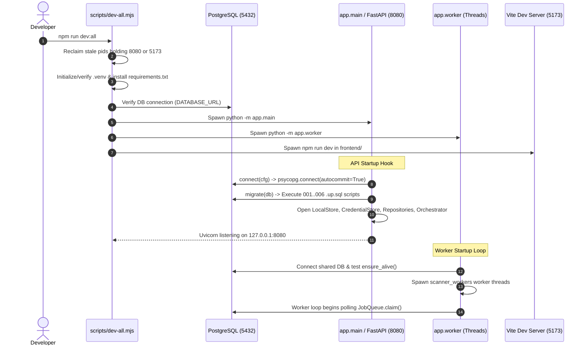
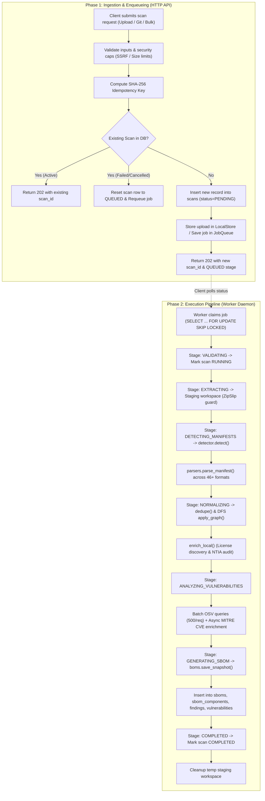

# S-BOM End-to-End Architecture & Data Flow

This document specifies how data moves through the S-BOM system across application startup, HTTP ingestion, worker polling, scanner pipeline execution, vulnerability correlation, relational persistence, and frontend telemetry.

---

## 1. System Startup & Initialization Lifecycle



---

## 2. API Request Lifecycle & Middleware Ordering

Every HTTP request entering FastAPI travels through a deterministic sequence:

1. **Request ID Middleware** (`request_id` in [`server.py`](file:///d:/Work_Stuff/Projects/S-BOM/backend/app/api/server.py#L98-L105)):
   - Checks `X-Request-Id` request header; if missing, generates `str(uuid.uuid4())`.
   - Stores request ID in `request.state.request_id`.
   - Injects `X-Request-Id` into the outgoing HTTP response header.
2. **CORS Middleware** (`CORSMiddleware`):
   - Validates origins against `cfg.api_allow_origins`.
   - Allows headers: `Content-Type`, `Authorization`, `X-Organization-Id`, `X-User-Id`, `X-Request-Id`.
   - Caches preflight `OPTIONS` requests for 600 seconds.
3. **Tenant Scoping Extraction** (`_org(request)`):
   - Extracts `X-Organization-Id` from headers.
   - If missing or empty, safely defaults to `'default'`.
4. **Controller Routing & Parameter Binding**:
   - Routes to matched FastAPI endpoint.
   - Parses multipart forms, JSON bodies, or query parameters.
5. **Response Envelope Serialization**:
   - **Success (200, 201, 202)**: Wraps payload in `{"success": true, "data": ..., "request_id": rid}`.
   - **Client Error (400, 404, 409)**: Returns `{"success": false, "error": {"code": ..., "message": ...}, "request_id": rid}`.
   - **Internal Error (500, 503)**: Trapped cleanly, logged with stack traces, and serialized without leaking database internals.

---

## 3. End-to-End Scan Execution Path

The execution flow of a scan is decoupled into two asynchronous phases: **Scan Intake & Enqueueing (API)** and **Pipeline Processing & Persisting (Worker)**.



---

## 4. Deep Stage-by-Stage Trace of the Pipeline

### Step 1: Ingestion & Idempotency Resolution
- **Local Upload** ([`server.py:134`](file:///d:/Work_Stuff/Projects/S-BOM/backend/app/api/server.py#L134)): Validates `Content-Length <= MAX_UPLOAD_SIZE_BYTES` (default 1 GiB). Stored under `uploads/{org}/{uuid}-{safe_name}`.
- **Remote Git** ([`server.py:231`](file:///d:/Work_Stuff/Projects/S-BOM/backend/app/api/server.py#L231)): Validates repository URL against SSRF blocklist (blocking loopbacks, 10.0.0.0/8, 172.16.0.0/12, 192.168.0.0/16, and cloud metadata `169.254.169.254`).
- **Idempotency Key Formulation**:
  ```python
  key = sha256(
      f"{org}|{app_id}|{bom_type}|{source_type}|{repo_url}|{branch}|{commit_sha}|{upload_hash}|{scanner_name}|{scanner_version}|"
  )
  ```
  If an identical active scan already exists, the API returns the existing record immediately. If a previously failed or cancelled scan matches, it resets the record to `QUEUED` and re-runs.

### Step 2: Queue Lease & Worker Lock
- Worker threads poll [`JobQueue.claim(visibility_seconds)`](file:///d:/Work_Stuff/Projects/S-BOM/backend/app/repositories/store.py#L318).
- Atomically claims the highest priority oldest job using PostgreSQL row-level locks:
  ```sql
  SELECT id, organization_id, bom_type, source_type, priority, attempts, max_attempts, job_payload, idempotency_key
  FROM scans
  WHERE job_status = 'QUEUED' AND next_attempt_at <= NOW()
  ORDER BY priority DESC, created_at ASC
  LIMIT 1
  FOR UPDATE SKIP LOCKED;
  ```
- Increments `attempts = attempts + 1`, sets `job_status = 'RUNNING'`, and updates `next_attempt_at = NOW() + visibility_seconds` (handling worker crash timeouts).

### Step 3: Workspace Staging & Zip-Slip Protection
- Local archive or GitHub tarball is extracted into `tempfile.mkdtemp(prefix="sbom-")`.
- **Zip-Slip Guard** ([`security/archives.py:103`](file:///d:/Work_Stuff/Projects/S-BOM/backend/app/security/archives.py#L103)):
  `safe_join` verifies that every relative path resolves inside the target extraction root:
  ```python
  if os.path.commonpath([str(root_abs), str(dest)]) != str(root_abs):
      raise UnsafeArchive("path escapes root")
  ```
- **Zip-Bomb Guard**:
  - Rejects archives containing more than `MAX_FILES_PER_ARCHIVE` (50,000 files).
  - Rejects entries exceeding `MAX_ARCHIVE_ENTRY_BYTES` (1 GiB).
  - Tracks running decompression ratio; aborts if uncompressed bytes exceed 100x compressed bytes.

### Step 4: Manifest Detection (`app.scanner.detector`)
- Recursively walks staging directory up to maximum depth 30.
- Skips build output and package managers caches: `.git`, `node_modules`, `vendor`, `.venv`, `dist`, `target`, `build`, `__pycache__`.
- Identifies manifests using exact filename dictionaries:
  - npm: `package.json`, `package-lock.json`, `npm-shrinkwrap.json`, `yarn.lock`, `pnpm-lock.yaml`, `bun.lock`.
  - Python: `requirements.txt`, `constraints.txt`, `pyproject.toml`, `poetry.lock`, `uv.lock`, `pdm.lock`, `Pipfile`, `Pipfile.lock`.
  - Java/Maven: `pom.xml`, `build.gradle`, `build.gradle.kts`, `gradle.lockfile`.
  - Go: `go.mod`, `go.sum`.
  - Rust: `Cargo.toml`, `Cargo.lock`.
  - .NET: `*.csproj`, `packages.config`, `packages.lock.json`, `Directory.Packages.props`.
  - PHP: `composer.json`, `composer.lock`.
  - Ruby: `Gemfile`, `Gemfile.lock`.
  - Others: `pubspec.yaml`, `mix.exs`, `Package.swift`, `conanfile.txt`, `DESCRIPTION`, `cabal.project`, `*.opam`.

### Step 5: Static AST Parsing (`app.scanner.parsers`)
- Parses files statically as text without executing package manager hooks, compilers, or interpreters.
- Captures for each component:
  - `name`: Package name.
  - `version`: Version string or constraint.
  - `ecosystem`: Canonical ecosystem code (`npm`, `pypi`, `maven`, `go`, etc.).
  - `scope`: `runtime` vs `dev`.
  - `direct`: Boolean flag indicating top-level declaration vs transitive edge.
  - `hash`: Package content hash when present in lockfile.
  - `license`: Declared license string.

### Step 6: Deduplication & Graph Depth Computation
- **Version Resolution Preference** ([`pipeline.py:104`](file:///d:/Work_Stuff/Projects/S-BOM/backend/app/scanner/pipeline.py#L104)):
  When a project contains both a loose manifest (`package.json` specifying `"lodash": "^4.17.0"`) and a lockfile (`package-lock.json` specifying `"lodash": "4.17.21"`), the pipeline collapses duplicates and preserves the resolved lockfile version.
- **Dependency Graph DFS** ([`pipeline.py:173`](file:///d:/Work_Stuff/Projects/S-BOM/backend/app/scanner/pipeline.py#L173)):
  Assembles directed edges from `from_component_id` to `to_component_id`. Performs Depth-First Search from root components (incoming degree = 0 or direct = True), computing exact dependency depth:
  - `depth = 1`: Direct top-level dependency.
  - `depth >= 2`: Transitive dependency.

### Step 7: Local Enrichment & NTIA Compliance Audit
- **PURL Canonicalization**: Generates Package URLs according to the purl-spec:
  `pkg:{ecosystem}/{namespace}/{name}@{version}`.
- **License Inference**: Matches declared license names against canonical SPDX identifiers (`SPDX_ALIASES`). If missing, searches parent folder for `LICENSE`, `LICENSE.md`, or `COPYING` text.
- **NTIA Minimum Elements Audit** ([`pipeline.py:255`](file:///d:/Work_Stuff/Projects/S-BOM/backend/app/scanner/pipeline.py#L255)):
  Evaluates each component against federal US EO 14028 criteria:
  1. `ntia_supplier`: Has valid vendor/supplier name (not `NOASSERTION`).
  2. `ntia_name`: Valid package name present.
  3. `ntia_version`: Valid version identifier present.
  4. `ntia_identifier`: PURL or CPE present.
  5. `ntia_relationship`: Dependency edge recorded.
  6. `ntia_author`: Document author present.
  7. `ntia_timestamp`: Document generation timestamp recorded.

### Step 8: Asynchronous Vulnerability Correlation
- **Batch OSV Queries**: Sends up to 500 package queries in a single HTTP POST to `https://api.osv.dev/v1/querybatch`.
- **MITRE CVE Enrichment**:
  - Filters matching advisory IDs for standard `CVE-\d{4}-\d{4,}` identifiers.
  - In `mitre` mode (default), queries MITRE CVE Services API (`https://cveawg.mitre.org/api/cve/{id}`) across a thread pool of 8 concurrent workers.
  - Extracts CVSS v3.1 base score, vector string, CWE description, and fixed version.

### Step 9: Transactional Relational Persistence
Within an atomic database transaction ([`store.py:466`](file:///d:/Work_Stuff/Projects/S-BOM/backend/app/repositories/store.py#L466)):
1. Inserts snapshot into `sboms`.
2. Inserts unique packages into `sbom_components`.
3. Normalizes findings into `findings` and upserts unique CVEs into `vulnerabilities`.
4. Writes NTIA booleans and dependency edge arrays (`depends_on`).
5. Marks scan status as `COMPLETED`, recording timestamp and component totals.
6. Commits transaction and clears staging workspace on disk.

---

## 5. Failure Handling, Retries & Self-Healing

| Failure Condition | Handling Strategy | Error Classification | System Consequence |
|---|---|---|---|
| **Invalid Upload / Bad Zip** | Trapped during staging; staging folder unlinked immediately. | `TerminalError`: `UNSUPPORTED_SOURCE` | Scan marked `FAILED`. Job marked `FAILED` (no retries). |
| **Malformed Manifest** | Parser error caught in loop; logged to `raw_metadata.parse_errors`. | Non-fatal | Scan continues parsing remaining valid manifests in project. |
| **Transient Database Loss** | Trapped in `execute()`; triggers `_reconnect_unlocked()`. | Connection error | Auto-reconnects socket without dropping HTTP request or crashing worker thread. |
| **Database Lock Contention** | Trapped in `_save_snapshot()`; rolls back transaction. | `RetryableError` | Job rescheduled with exponential backoff: 5s, 30s, up to 15m. After `max_attempts` (3), moves to `DEAD_LETTER`. |
| **OSV / MITRE Network Timeout** | Trapped in `VulnProvider.correlate()`. | Non-fatal warning | Correlation error recorded in scan events; scan completes successfully preserving component graph. |
| **User Scan Cancellation** | `/cancel` updates scan and job `scan_status = 'CANCELLED'`. | `ScanCancelled` | Worker loop detects status at stage checkpoints, raises `ScanCancelled`, cleans up staging directory, and halts immediately. |
