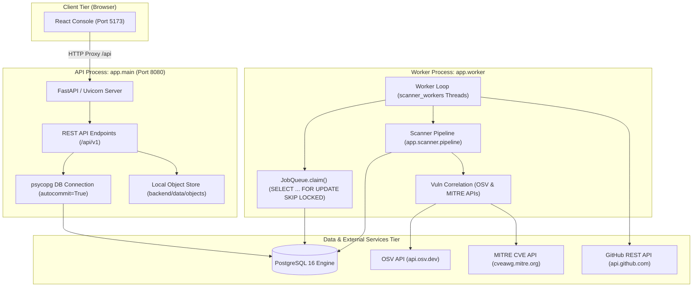

# S-BOM System Architecture & Codebase Overview

## 1. Executive Technical Overview

**S-BOM** (Software Bill of Materials) is an enterprise-grade platform designed to generate, catalog, analyze, correlate, and export software bills of materials across multi-ecosystem repositories, archives, and local projects.

The platform continuously solves three core industrial challenges:
1. **Supply Chain Visibility & Provenance**: Discovers direct and transitive software dependencies across 15+ packaging ecosystems and 46+ distinct manifest/lockfile formats.
2. **Automated Vulnerability Intelligence & Correlation**: Correlates component identities (via canonical Package URLs — `purl`) against Open Source Vulnerabilities (OSV) and the MITRE/NVD CVE database, determining base severity, CVSS scores, vector strings, and available remediation/patch versions.
3. **Regulatory Audit Readiness & Standard Interchange**: Produces machine-verifiable compliance scores (NTIA minimum elements under US Executive Order 14028) and exports industry-standard formats: **CycloneDX 1.5 JSON**, **SPDX 2.3 JSON**, **CSV**, and **XLSX**.

---

## 2. Technology Stack & Runtime Topology

| Layer | Technologies & Runtime | Responsibilities |
|---|---|---|
| **Process Orchestration** | Node.js (`scripts/dev-all.mjs`), Native OS subprocess control | Supervises API, asynchronous Worker, and Vite dev server, reclaims orphaned TCP ports (8080, 5173), configures development KEKs and environment. |
| **Backend Runtime** | Python 3.10+ (via virtualenv `.venv`) | Fast, type-annotated application core with zero-heavy-framework overhead. |
| **API Framework** | FastAPI (>= 0.115), Uvicorn (>= 0.32), Starlette | Asynchronous HTTP REST API, CORS middleware, multipart file uploads, JSON envelope serialization. |
| **Database Engine** | PostgreSQL 16+ (via `psycopg[binary]>=3.2`), Raw SQL migrations | Fully relational, normalized 10-table schema with transactional updates and queue locking. |
| **Job Queue** | Durable PostgreSQL queue using `SELECT ... FOR UPDATE SKIP LOCKED` | Multi-threaded worker pool job leasing, retry exponential backoff, dead-letter state tracking. |
| **Object Storage** | `app.storage.LocalStore` (abstracted for local disk or object storage) | Path-traversal-hardened filesystem storage for uploaded tarballs, zip archives, and staged workspaces. |
| **Security Cryptography** | `cryptography>=43` (AES-256-GCM AEAD) | Envelope encryption of Git personal access tokens (PAT) and GitHub App private keys with 32-byte Key Encryption Keys (KEK). |
| **Vulnerability Feeds** | HTTPX (`httpx>=0.27`) | Concurrent async batch queries to OSV (`api.osv.dev`) and MITRE CVE Services (`cveawg.mitre.org`). |
| **Frontend Framework** | React 18 (`react`, `react-dom`), TypeScript 5.7+ | Single Page Application (SPA), React Router v6, context-based state management (`AppStateContext`). |
| **Frontend Styling** | TailwindCSS v3.4+, PostCSS, Lucide React icons | Sleek enterprise cybersecurity interface, dark/light theme support. |
| **Data Visualization** | Recharts (>= 2.15) | Posture gauges, risk donuts, vulnerability aging histograms, and compliance trends. |

---

## 3. High-Level Process Architecture

The system executes as three coordinated decoupled processes:



---

## 4. Repository Directory Structure

```text
S-BOM/
├── .gitignore
├── package.json               # Root launcher scripts ("npm run dev:all")
├── scripts/
│   └── dev-all.mjs            # Node.js process supervisor & port reclaimer
├── docs/                      # Architectural knowledge base & technical specifications
│   ├── codebase-overview.md
│   ├── file-inventory.md
│   ├── architecture-and-data-flow.md
│   ├── database-relationships.md
│   ├── api-reference.md
│   ├── dependency-map.md
│   └── known-issues-and-risks.md
├── backend/
│   ├── .env.example           # Canonical configuration blueprint
│   ├── docker-compose.yml     # PostgreSQL 16 local development container
│   ├── requirements.txt       # Production Python dependencies
│   ├── migrations/            # Ordered SQL schema evolution scripts
│   │   ├── 001_initial.up.sql
│   │   ├── 002_security_scans_move.up.sql
│   │   ├── 004_software_inventory.up.sql
│   │   ├── 005_relational_facts.up.sql
│   │   └── 006_ten_tables.up.sql  # Canonical 10-table schema consolidation
│   ├── tests/                 # Integration test suite (pytest)
│   └── app/
│       ├── main.py            # API entry point (uvicorn runner)
│       ├── worker.py          # Background worker entry point (threaded pollers)
│       ├── api/               # HTTP route controllers & response envelopes
│       ├── core/              # Config, DB connection manager, live metrics
│       ├── catalog/           # Project & Application tenant hierarchy store
│       ├── credentials/       # AES-GCM credential encryption & storage
│       ├── export/            # CycloneDX, SPDX, CSV, XLSX serialization
│       ├── projects/          # Aggregated dashboard metrics & project views
│       ├── repositories/      # Core SQL persistence & normalized facts
│       ├── scanner/           # Manifest detection, parsing, deduplication, graph DFS
│       ├── scans/             # Orchestrator, scan lifecycle, cancel/rescan logic
│       ├── security/          # Zip-bomb, path traversal, and SSRF defenses
│       ├── sources/           # Upload staging, GitHub tarball fetcher, bulk parser
│       ├── storage/           # Local filesystem object store
│       └── vulnerabilities/   # OSV & MITRE concurrent vulnerability correlation
└── frontend/
    ├── package.json           # React dependencies & Vite build scripts
    ├── vite.config.ts         # Vite server & reverse-proxy routing
    ├── index.html             # Single-page HTML shell
    ├── src/
    │   ├── main.tsx           # React DOM root entry
    │   ├── App.tsx            # Application routing table
    │   ├── api/client.ts      # Typed backend client & envelope unwrap
    │   ├── context/           # React contexts (AppStateContext, ThemeContext)
    │   ├── types/index.ts     # Domain models & TypeScript interfaces
    │   ├── components/        # Reusable UI widgets, navigation, modals, layout
    │   └── pages/             # Route views (Dashboard, Scans, Inventory, Export, etc.)
```

---

## 5. Architectural Principles & Tenets

1. **Strict Multi-Tenancy**: Every request is scoped to an organization via `X-Organization-Id` (defaulting to `'default'`). Scans, projects, credentials, and components are partitioned by tenant.
2. **Asynchronous Non-Blocking Execution**: Scan creation returns immediately with HTTP `202 Accepted` and a `scan_id`. Manifest detection, decompression, AST parsing, network calls, and database persistence occur strictly in background worker threads.
3. **Idempotency by Design**: Every scan computes a SHA-256 idempotency key over tenant ID, target, source type, repository URL/upload hash, and engine version. Duplicate scan submissions return existing records without consuming queue bandwidth.
4. **Relational Fact Storage**: Component relationships, dependencies, and vulnerability findings are normalized into relational tables with strict foreign key constraints, cascading deletes, and indexed query patterns.
5. **Zero-Trust Input Processing**: Uploaded zip and tar files are bounded by decompression caps (uncompressed size limit, maximum file count, compression ratio checks against zip-bombs). Remote Git URLs are validated against SSRF blocklists prohibiting loopback, private RFC-1918/RFC-4193 addresses, and cloud instance metadata endpoints (169.254.169.254).
