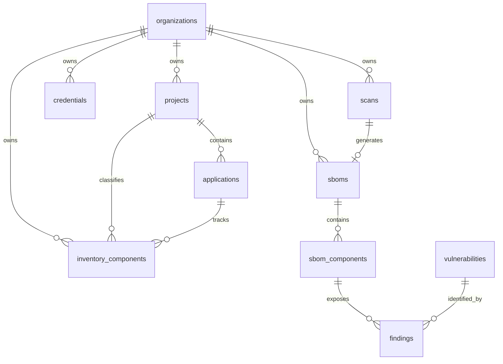

# S-BOM Database Schema & Entity Relationship Specification

The persistence tier of S-BOM was consolidated in migration `006_ten_tables.up.sql` into **10 canonical relational tables**. All legacy tables (`tbl_*`) were migrated and dropped.

---

## 1. Relational Entity Diagram

---

## 2. Comprehensive Entity-Relationship Table

| Source Entity | Source Column | Target Entity | Target Column | Relationship | Constraint Type | Code References |
|---|---|---|---|---|---|---|
| `projects` | `organization_id` | `organizations` | `id` | Many-to-One | `FOREIGN KEY ... ON DELETE CASCADE` | [`006_ten_tables.up.sql:29`](file:///d:/Work_Stuff/Projects/S-BOM/backend/migrations/006_ten_tables.up.sql#L29) |
| `applications` | `(project_id, organization_id)` | `projects` | `(id, organization_id)` | Many-to-One | `FOREIGN KEY ... ON DELETE CASCADE` | [`006_ten_tables.up.sql:41`](file:///d:/Work_Stuff/Projects/S-BOM/backend/migrations/006_ten_tables.up.sql#L41) |
| `inventory_components` | `organization_id` | `organizations` | `id` | Many-to-One | `FOREIGN KEY ... ON DELETE CASCADE` | [`006_ten_tables.up.sql:64`](file:///d:/Work_Stuff/Projects/S-BOM/backend/migrations/006_ten_tables.up.sql#L64) |
| `inventory_components` | `(project_id, organization_id)` | `projects` | `(id, organization_id)` | Many-to-One | `FOREIGN KEY ... ON DELETE CASCADE` | [`006_ten_tables.up.sql:65`](file:///d:/Work_Stuff/Projects/S-BOM/backend/migrations/006_ten_tables.up.sql#L65) |
| `inventory_components` | `(application_id, project_id, organization_id)` | `applications` | `(id, project_id, organization_id)` | Many-to-One | `FOREIGN KEY ... ON DELETE CASCADE` | [`006_ten_tables.up.sql:66`](file:///d:/Work_Stuff/Projects/S-BOM/backend/migrations/006_ten_tables.up.sql#L66) |
| `credentials` | `organization_id` | `organizations` | `id` | Many-to-One | `FOREIGN KEY ... ON DELETE CASCADE` | [`006_ten_tables.up.sql:88`](file:///d:/Work_Stuff/Projects/S-BOM/backend/migrations/006_ten_tables.up.sql#L88) |
| `scans` | `organization_id` | `organizations` | `id` | Many-to-One | `FOREIGN KEY ... ON DELETE CASCADE` | [`006_ten_tables.up.sql:132`](file:///d:/Work_Stuff/Projects/S-BOM/backend/migrations/006_ten_tables.up.sql#L132) |
| `sboms` | `organization_id` | `organizations` | `id` | Many-to-One | `FOREIGN KEY ... ON DELETE CASCADE` | [`006_ten_tables.up.sql:162`](file:///d:/Work_Stuff/Projects/S-BOM/backend/migrations/006_ten_tables.up.sql#L162) |
| `sboms` | `scan_id` | `scans` | `id` | One-to-One | `FOREIGN KEY ... ON DELETE CASCADE` | [`006_ten_tables.up.sql:163`](file:///d:/Work_Stuff/Projects/S-BOM/backend/migrations/006_ten_tables.up.sql#L163) |
| `sbom_components` | `sbom_id` | `sboms` | `id` | Many-to-One | `FOREIGN KEY ... ON DELETE CASCADE` | [`006_ten_tables.up.sql:193`](file:///d:/Work_Stuff/Projects/S-BOM/backend/migrations/006_ten_tables.up.sql#L193) |
| `findings` | `sbom_id` | `sboms` | `id` | Many-to-One | `FOREIGN KEY ... ON DELETE CASCADE` | [`006_ten_tables.up.sql:225`](file:///d:/Work_Stuff/Projects/S-BOM/backend/migrations/006_ten_tables.up.sql#L225) |
| `findings` | `(sbom_component_id, sbom_id)` | `sbom_components` | `(id, sbom_id)` | Many-to-One | `FOREIGN KEY ... ON DELETE CASCADE` | [`006_ten_tables.up.sql:226`](file:///d:/Work_Stuff/Projects/S-BOM/backend/migrations/006_ten_tables.up.sql#L226) |
| `findings` | `vulnerability_id` | `vulnerabilities` | `id` | Many-to-One | `FOREIGN KEY ... ON DELETE RESTRICT` | [`006_ten_tables.up.sql:227`](file:///d:/Work_Stuff/Projects/S-BOM/backend/migrations/006_ten_tables.up.sql#L227) |
| *scans (logical)* | `catalog_project_id` | `projects` | `id` | Many-to-One (Optional) | Application Inferred (No explicit FK to prevent ingest lockouts) | [`store.py:73`](file:///d:/Work_Stuff/Projects/S-BOM/backend/app/repositories/store.py#L73) |
| *scans (logical)* | `catalog_application_id` | `applications` | `id` | Many-to-One (Optional) | Application Inferred | [`store.py:73`](file:///d:/Work_Stuff/Projects/S-BOM/backend/app/repositories/store.py#L73) |
| *sboms (logical)* | `catalog_project_id` | `projects` | `id` | Many-to-One (Optional) | Application Inferred | [`facts.py:68`](file:///d:/Work_Stuff/Projects/S-BOM/backend/app/repositories/facts.py#L68) |
| *sboms (logical)* | `catalog_application_id` | `applications` | `id` | Many-to-One (Optional) | Application Inferred | [`facts.py:68`](file:///d:/Work_Stuff/Projects/S-BOM/backend/app/repositories/facts.py#L68) |

---

## 3. Detailed Table Specifications

### 1. `organizations`
- **Purpose**: Multi-tenant boundary root.
- **Primary Key**: `id TEXT`.
- **Columns**:
  - `name TEXT NOT NULL`
  - `created_at TIMESTAMPTZ NOT NULL DEFAULT CURRENT_TIMESTAMP`

### 2. `projects`
- **Purpose**: Logical software project or repository grouping within an organization.
- **Primary Key**: `id TEXT`.
- **Unique Constraints**: `UNIQUE (organization_id, name)`, `UNIQUE (id, organization_id)`.
- **Foreign Keys**: `organization_id -> organizations(id) ON DELETE CASCADE`.
- **Check Constraints**: `CHECK (length(btrim(name)) > 0)`.

### 3. `applications`
- **Purpose**: Specific application, microservice, or build target belonging to a project.
- **Primary Key**: `id TEXT`.
- **Unique Constraints**: `UNIQUE (organization_id, project_id, name)`, `UNIQUE (id, project_id, organization_id)`.
- **Foreign Keys**: `(project_id, organization_id) -> projects(id, organization_id) ON DELETE CASCADE`.
- **Check Constraints**: `CHECK (length(btrim(name)) > 0)`.

### 4. `inventory_components`
- **Purpose**: Software packages registered into the tenant's ongoing Software Inventory.
- **Primary Key**: `id TEXT`.
- **Columns**: `organization_id`, `project_id`, `application_id`, `name`, `package_name`, `version`, `component_type` (default `'Library'`), `source_file_name`, `license_name`, `package_url`, `ecosystem`, `risk_level`, `vulnerability_count`, `is_direct_dependency`, `supplier_name`, `created_by`, `created_at`.
- **Foreign Keys**: Cascades on `organizations`, `projects`, and `applications`.
- **Checks**: Non-empty `name`, non-empty `version`, `vulnerability_count >= 0`.

### 5. `credentials`
- **Purpose**: Git credentials (Personal Access Tokens or GitHub App private keys).
- **Primary Key**: `id TEXT`.
- **Columns**:
  - `secret_reference TEXT`: Opaque identifier (e.g. `encdb:uuid`).
  - `secret_nonce BYTEA`: 12-byte random nonce generated per encryption operation.
  - `secret_ciphertext BYTEA`: AES-256-GCM encrypted payload.
  - `repository_scope TEXT`: Comma-separated list of allowed repos or `'*'`.
  - `status TEXT`: `'ACTIVE'` or `'REVOKED'`.
  - `created_at`, `updated_at`, `last_validated_at`, `expires_at`.

### 6. `scans`
- **Purpose**: Durable record of scan runs and the durable asynchronous job queue.
- **Primary Key**: `id TEXT`.
- **Columns**:
  - `idempotency_key TEXT NOT NULL UNIQUE`: Prevents duplicate concurrent or identical runs.
  - `scan_status TEXT`: `'PENDING'`, `'QUEUED'`, `'RUNNING'`, `'COMPLETED'`, `'FAILED'`, `'CANCELLED'`.
  - `scan_stage TEXT`: Real-time lifecycle stage (`'VALIDATING'`, `'EXTRACTING'`, `'DETECTING_MANIFESTS'`, `'NORMALIZING'`, `'ANALYZING_VULNERABILITIES'`, `'GENERATING_SBOM'`, `'COMPLETED'`).
  - `job_status TEXT`: Queue lease state (`'QUEUED'`, `'RUNNING'`, `'COMPLETED'`, `'FAILED'`, `'DEAD_LETTER'`, `'CANCELLED'`).
  - `job_payload TEXT`: JSON configuration payload containing object storage keys, git URLs, branches, and credentials.
  - `priority INTEGER`, `attempts INTEGER`, `max_attempts INTEGER`, `next_attempt_at TIMESTAMPTZ`.
  - `events JSONB NOT NULL DEFAULT '[]'::jsonb`: Append-only array of stage transition event objects.
  - `bulk_scan_id TEXT`, `bulk_row_number INTEGER`, `bulk_errors TEXT`: Links to batch spreadsheet imports.

### 7. `sboms`
- **Purpose**: Stored SBOM document metadata produced by a completed scan.
- **Primary Key**: `id TEXT`.
- **Foreign Keys**: `organization_id -> organizations(id) ON DELETE CASCADE`, `scan_id -> scans(id) ON DELETE CASCADE`.
- **Columns**: `project_id`, `application_id`, `catalog_project_id`, `catalog_application_id`, `bom_type`, `application_version`, `version_strategy`, `repository_url`, `repository_branch`, `commit_sha`, `commit_author`, `commit_email`, `commit_message`, `scanner_name`, `scanner_version`, `bom_format_version`, `generated_at`, `raw_metadata TEXT`, `facts_normalized BOOLEAN`.

### 8. `sbom_components`
- **Purpose**: Every individual software package discovered in an SBOM.
- **Primary Key**: `id TEXT`.
- **Unique Constraints**: `UNIQUE (id, sbom_id)`.
- **Foreign Keys**: `sbom_id -> sboms(id) ON DELETE CASCADE`.
- **Columns**:
  - Identity: `name`, `version`, `ecosystem`, `package_manager`, `package_url` (`purl`), `cpe`, `content_hash`.
  - Legal & Provenance: `license_name`, `supplier_name`, `source_manifest`.
  - Graph: `dependency_scope` (`'runtime'` / `'dev'`), `is_direct_dependency BOOLEAN`, `dependency_depth INTEGER`, `depends_on TEXT[]` (Array of child component IDs).
  - NTIA 7 Elements: `ntia_supplier`, `ntia_name`, `ntia_version`, `ntia_identifier`, `ntia_relationship`, `ntia_author`, `ntia_timestamp`.

### 9. `vulnerabilities`
- **Purpose**: Canonical advisory/CVE database record.
- **Primary Key**: `id TEXT`.
- **Unique Constraints**: `vulnerability_key TEXT NOT NULL UNIQUE` (e.g. `CVE-2023-45133` or `GHSA-xxx`).
- **Columns**:
  - `severity TEXT CHECK (severity IN ('CRITICAL', 'HIGH', 'MEDIUM', 'LOW', 'UNKNOWN'))`
  - `cvss_score NUMERIC(4,1) CHECK (cvss_score >= 0 AND cvss_score <= 10)`
  - `cvss_vector TEXT`, `description TEXT`, `reference_urls TEXT[]`
  - `created_at TIMESTAMPTZ`, `updated_at TIMESTAMPTZ`

### 10. `findings`
- **Purpose**: Normalized join linking a package within an SBOM to a known vulnerability.
- **Primary Key**: `id TEXT`.
- **Unique Constraints**: `UNIQUE (sbom_component_id, vulnerability_id)`.
- **Foreign Keys**:
  - `sbom_id -> sboms(id) ON DELETE CASCADE`
  - `(sbom_component_id, sbom_id) -> sbom_components(id, sbom_id) ON DELETE CASCADE`
  - `vulnerability_id -> vulnerabilities(id) ON DELETE RESTRICT` (Protects advisory definitions from deletion while findings reference them).
- **Columns**: `source` (e.g. `'mitre'`, `'osv'`), `severity`, `cvss_score`, `cvss_vector`, `description`, `fixed_version`, `created_at`.
