# S-BOM Dependency Map & Call Graph Analysis

This document maps the architectural call graph, module dependencies, service-to-repository wiring, and external package usage across the S-BOM codebase.

---

## 1. Backend Module Call Graph

```mermaid
flowchart TD
    Main["app.main"] --> Build["app.api.build()"]
    Worker["app.worker"] --> Build
    Build --> Config["app.core.config"]
    Build --> DB["app.core.db"]
    Build --> OpenStore["app.storage.open_store"]
    Build --> CredStore["app.credentials.CredentialStore"]
    Build --> Creds["app.credentials.Credentials"]
    Build --> ScanRepo["app.repositories.ScanRepo"]
    Build --> BomRepo["app.repositories.BomRepo"]
    Build --> CatalogRepo["app.catalog.CatalogRepo"]
    Build --> JobQueue["app.repositories.JobQueue"]
    Build --> VulnProv["app.vulnerabilities.VulnProvider"]
    Build --> Orch["app.scans.Orchestrator"]

    Orch --> PrepLocal["app.sources.prepare_local"]
    Orch --> PrepGH["app.sources.prepare_github"]
    PrepLocal --> Archives["app.security.archives"]
    PrepGH --> Archives
    Orch --> Pipe["app.scanner.pipeline.scan_tree"]
    Pipe --> Detect["app.scanner.detector.detect"]
    Pipe --> Parsers["app.scanner.parsers.parse_manifest"]
    Pipe --> LocalEnrich["app.scanner.pipeline.enrich_local"]
    Pipe --> NTIA["app.scanner.pipeline.audit_compliance"]
    Orch --> VulnCorr["VulnProvider.correlate"]
    VulnCorr --> OSVQuery["OSV Batch API"]
    VulnCorr --> MITREQuery["MITRE CVE API"]
    Orch --> SaveSnap["BomRepo.save_snapshot"]
    SaveSnap --> Facts["app.repositories.facts.persist_snapshot_facts"]
```

---

## 2. Service & Repository Dependency Matrix

| Component | Injected / Used Dependencies | Responsibilities Delegated |
|---|---|---|
| [`FastAPI App`](file:///d:/Work_Stuff/Projects/S-BOM/backend/app/api/server.py#L79) | `Config`, `Database`, `LocalStore`, `Credentials`, `Audit`, `ScanRepo`, `BomRepo`, `CatalogRepo`, `JobQueue`, `VulnProvider`, `Orchestrator` | Holds all singletons on `app.state`; serves REST routes. |
| [`Orchestrator`](file:///d:/Work_Stuff/Projects/S-BOM/backend/app/scans/orchestrator.py#L46) | `Config`, `ScanRepo`, `BomRepo`, `JobQueue`, `LocalStore`, `Credentials`, `Audit`, `VulnProvider` | Manages scan state machine (`create_scan`, `rescan`, `cancel`, `execute`). |
| [`ScanRepo`](file:///d:/Work_Stuff/Projects/S-BOM/backend/app/repositories/store.py#L64) | `Database`, `CatalogRepo` (via `resolve_catalog_ids`) | SQL persistence for `scans` table and stage transitions. |
| [`JobQueue`](file:///d:/Work_Stuff/Projects/S-BOM/backend/app/repositories/store.py#L292) | `Database` | Queue lease management with `SELECT ... FOR UPDATE SKIP LOCKED`. |
| [`BomRepo`](file:///d:/Work_Stuff/Projects/S-BOM/backend/app/repositories/store.py#L458) | `Database`, `facts.persist_snapshot_facts`, `facts.overlay_snapshot_facts` | Snapshot and package persistence in `sboms`, `sbom_components`, `inventory_components`. |
| [`CatalogRepo`](file:///d:/Work_Stuff/Projects/S-BOM/backend/app/catalog/store.py#L56) | `Database` | Tenant hierarchy persistence (`organizations`, `projects`, `applications`). |
| [`Credentials`](file:///d:/Work_Stuff/Projects/S-BOM/backend/app/credentials/service.py#L36) | `Database`, `CredentialStore` | Manages `credentials` table and invokes AES-256-GCM encryption/decryption. |
| [`VulnProvider`](file:///d:/Work_Stuff/Projects/S-BOM/backend/app/vulnerabilities/provider.py#L36) | `httpx.Client`, `ThreadPoolExecutor` | Queries OSV batch API and MITRE CVE endpoints concurrently. |

---

## 3. External Dependencies & Third-Party Library Mapping

### Backend (`requirements.txt`)

| Package | Minimum Version | Imported By | Critical Functionality Supported |
|---|---|---|---|
| `fastapi` | 0.115 | `app.api.server` | REST API framework, route handlers, dependency injection, and exception handling. |
| `uvicorn` | 0.32 | `app.main` | High-performance ASGI server runner with live reloading. |
| `python-multipart` | 0.0.12 | `app.api.server` | Streaming parsing of multipart form file uploads (`UploadFile`). |
| `httpx` | 0.27 | `app.sources.workspace`, `app.vulnerabilities.provider` | HTTP client for streaming GitHub repository tarballs and concurrent CVE queries. |
| `openpyxl` | 3.1 | `app.sources.workspace`, `app.export.formats` | Reading `.xlsx` bulk scan spreadsheets and generating formatted Excel SBOM exports. |
| `cryptography` | 43.0 | `app.credentials.service` | AES-256-GCM AEAD encryption of Git tokens and private keys at rest. |
| `psycopg[binary]` | 3.2 | `app.core.db` | High-performance PostgreSQL database adapter, handling row-locking and connection recovery. |

### Frontend (`frontend/package.json`)

| Package | Version | Imported By | Critical Functionality Supported |
|---|---|---|---|
| `react` & `react-dom` | ^18.3.1 | Whole application | UI component tree rendering, React hooks (`useState`, `useEffect`, `useMemo`, `useRef`). |
| `react-router-dom` | ^6.29.0 | `App.tsx`, Navigation components | Client-side routing, route parameters (`useParams`), query parsing (`useSearchParams`). |
| `recharts` | ^2.15.1 | `Dashboard.tsx` | SVG-based responsive charting (gauges, line charts, pie charts). |
| `lucide-react` | ^0.475.0 | All page components | Cohesive iconography across security scanners, CVEs, and compliance tables. |
| `xlsx` | ^0.18.5 | `SoftwareInventory.tsx`, `UploadInventoryModal.tsx` | In-browser parsing and generation of spreadsheet data. |
| `clsx` & `tailwind-merge` | ^2.1.1 / ^2.6.0 | Common components | Conditional CSS utility merging without Tailwind class collisions. |

---

## 4. Coupling Analysis & Architectural Observations

### Strengths & Loose Coupling
1. **Engine Decoupled from Web Framework**: The scanner pipeline (`pipeline.py`, `detector.py`, `parsers.py`) is completely independent of FastAPI or HTTP. It accepts a local filesystem directory string and returns pure Python dictionaries. It can be executed via CLI, background workers, or standalone tests with zero HTTP overhead.
2. **Abstract Object Store**: Storage operations are mediated through `LocalStore`, isolating the rest of the application from specific disk or cloud bucket implementations.
3. **Pluggable Vulnerability Providers**: `VulnProvider` abstracts whether vulnerability queries are routed to OSV alone or enriched with MITRE CVE Services records.

### Tight Coupling & Architectural Observations
1. **Single Database Connection with RLock**: [`Database` in `app.core.db`](file:///d:/Work_Stuff/Projects/S-BOM/backend/app/core/db.py#L79) uses a single shared `psycopg` connection wrapped in a `threading.RLock`. While this prevents concurrent socket collisions across worker threads, statement execution is serialized through that lock. High-volume parallel scans will contend on this lock. (In production, a connection pool such as `psycopg_pool.ConnectionPool` would remove lock serialization).
2. **Dual-Role `scans` Table**: In migration 006, the `scans` table serves as both the persistent audit log of scan executions and the durable message queue (`job_status`, `job_payload`, `attempts`, `next_attempt_at`). While this keeps the schema simple, heavy queue polling (`SELECT ... FOR UPDATE SKIP LOCKED` every 500ms) runs against the same table as user scan queries.
