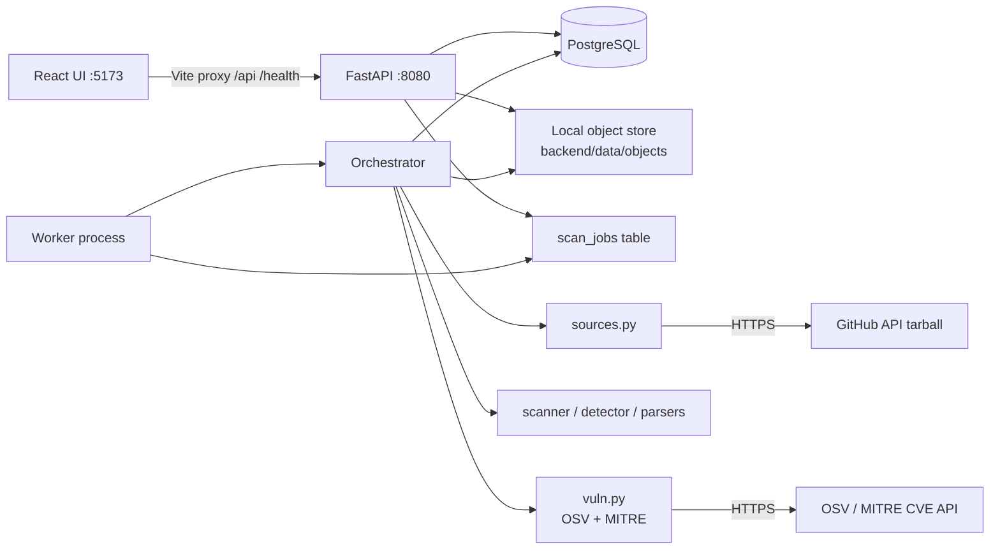
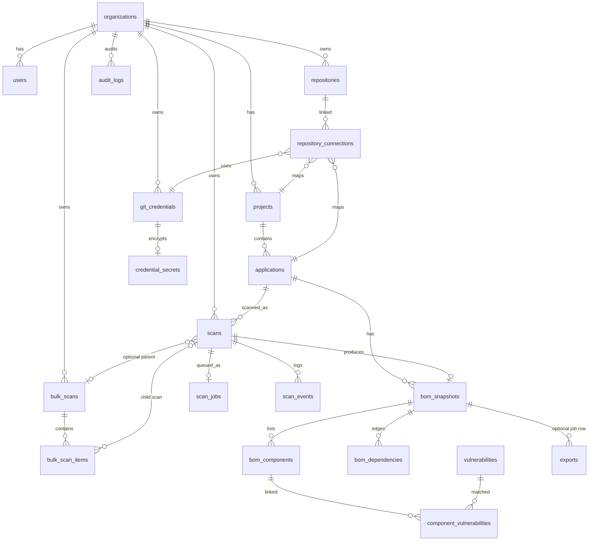
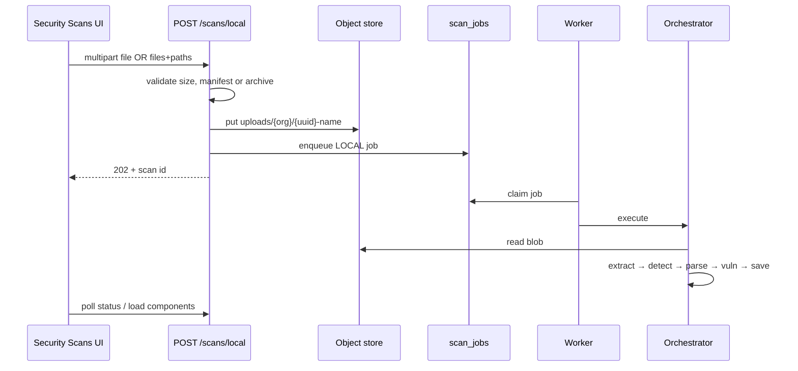
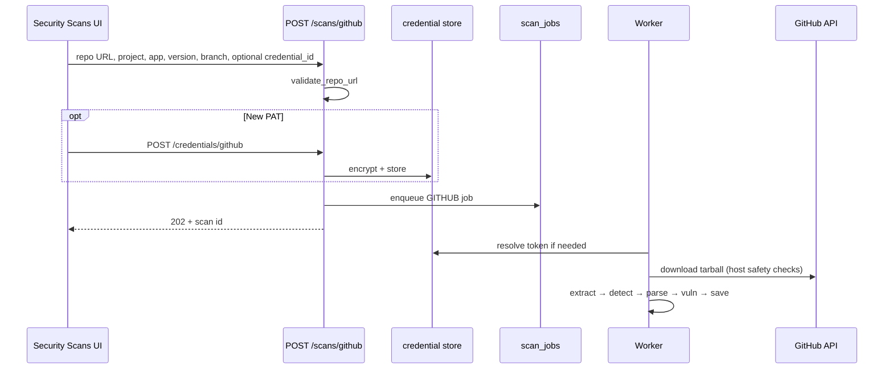
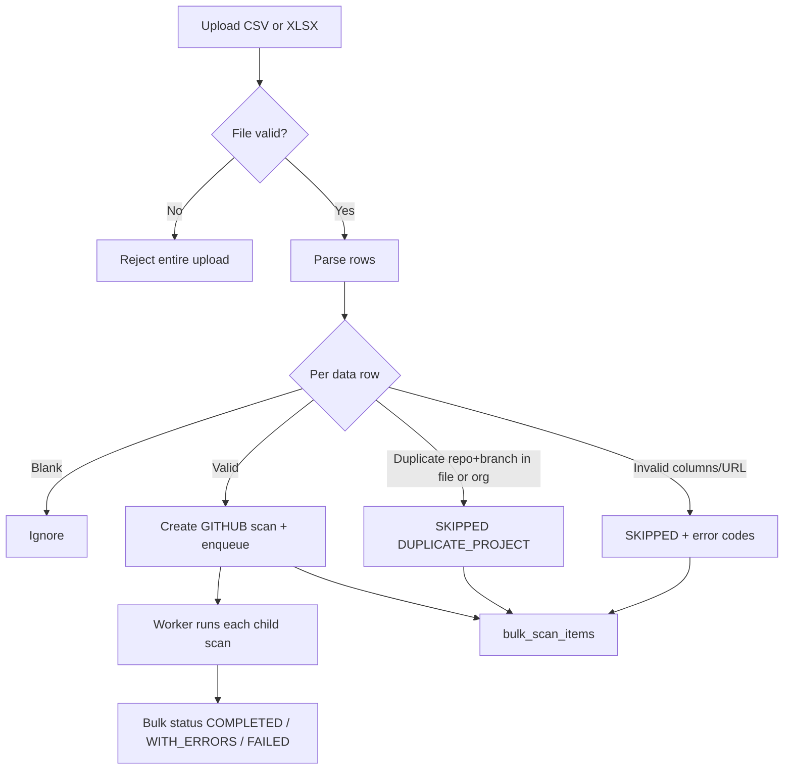

# S-BOM Project Workflow

This document explains how the S-BOM (Software Bill of Materials) platform works end to end: system architecture, API gateways, database relationships, the three scan paths (local, GitHub, bulk), and what each console module should and should not contain.

It is written for engineers and product owners who need a clear mental model before changing code or designing UI.

---

## Table of contents

1. [What the product does](#1-what-the-product-does)
2. [System architecture](#2-system-architecture)
3. [Main API gateways](#3-main-api-gateways)
4. [Database schema and relationships](#4-database-schema-and-relationships)
5. [Scan pipeline (shared stages)](#5-scan-pipeline-shared-stages)
6. [Local scan logic](#6-local-scan-logic)
7. [GitHub (Git) scan logic](#7-github-git-scan-logic)
8. [Bulk scan logic](#8-bulk-scan-logic)
9. [Console modules — depth guide](#9-console-modules--depth-guide)
   - [Dashboard](#91-dashboard)
   - [Security Scans](#92-security-scans)
   - [Export Center](#93-export-center)
   - [Software Inventory](#94-software-inventory)
   - [Vulnerability Management](#95-vulnerability-management)
   - [Remediation Tickets](#96-remediation-tickets)
   - [Regulatory Compliance](#97-regulatory-compliance)
   - [Security Policies](#98-security-policies)
   - [Supply Chain and Provenance](#99-supply-chain-and-provenance)
   - [Continuous Monitoring](#910-continuous-monitoring)
   - [Enterprise Integrations](#911-enterprise-integrations)
10. [What is live vs planned](#10-what-is-live-vs-planned)
11. [Quick reference](#11-quick-reference)

---

## 1. What the product does

S-BOM is an enterprise SBOM console. Operators upload source (a folder, archive, or GitHub repository), the platform builds a component graph, correlates known vulnerabilities, stores a snapshot, and lets the team inventory packages, triage CVEs, export standard formats, and (over time) manage remediation, compliance, and supply-chain trust.

**Three processes run locally:**

| Process | Port / role | Entry |
| --- | --- | --- |
| API | `8080` — HTTP + queue writes | `python -m app.main` |
| Worker | No HTTP — claims jobs and runs scans | `python -m app.worker` |
| UI | `5173` — React console | Vite (`npm run dev`) |

`npm run dev:all` (via `scripts/dev-all.mjs`) starts all three. PostgreSQL (Docker Compose in `backend/`) must already be running. The UI proxies `/api` and `/health` to the API.

**Tenant scope:** every request carries `X-Organization-Id` (the UI currently sends `default`).

---

## 2. System architecture

### 2.1 High-level picture



### 2.2 How a request becomes a finished SBOM

1. User starts a scan in **Security Scans**.
2. API stores the upload (local) or validates the repo URL (GitHub / bulk), inserts a `scans` row and a `scan_jobs` row, returns `202` with a scan id.
3. Worker claims the job (`SELECT … FOR UPDATE SKIP LOCKED`).
4. Orchestrator prepares a temp workspace, detects manifests, parses packages, normalizes, correlates CVEs, saves a BOM snapshot.
5. UI polls status, then loads components and vulnerabilities into shared React state (`AppStateContext`). Other pages read that state.

### 2.3 Backend module map

| Module | Responsibility |
| --- | --- |
| `api.py` | HTTP routes, auth header → org, uploads, exports |
| `orchestrator.py` | Scan lifecycle, stages, rescan / cancel |
| `sources.py` | Local extract, GitHub download, bulk CSV/XLSX parse |
| `security.py` | Zip-bomb limits, path escape guards, outbound host checks |
| `detector.py` | Find supported manifests (depth-capped walk) |
| `parsers.py` | Turn one manifest into components + edges |
| `scanner.py` | Aggregate, dedupe, enrich, audit compliance notes |
| `vuln.py` | Correlate packages to advisories |
| `repos.py` | Scans, job queue, BOM persistence |
| `export.py` | CycloneDX, SPDX, CSV, XLSX bytes |
| `credentials.py` | Encrypted GitHub PATs / App keys |
| `storage.py` | Local blob store for uploads |
| `db.py` | PostgreSQL + migrations |

### 2.4 Frontend data bridge

Almost every page reads from `AppStateContext`, which:

- On mount: `GET /health/ready` and `GET /api/v1/scans`, then expands completed scans into components / vulns.
- For new work: `startScan` → local / GitHub / bulk APIs, then `watchScan` polls until done.
- For export: `exportSBOM` hits the scan export route when a latest scan id exists.

**Important boundary:** tickets, policies, and manually added inventory rows currently live in React state only (not PostgreSQL). Refresh reloads scan-derived data from the API; local-only edits are lost.

---

## 3. Main API gateways

All JSON responses use an envelope:

```json
{ "success": true, "data": { }, "request_id": "…" }
```

or

```json
{ "success": false, "error": { "code": "…", "message": "…" }, "request_id": "…" }
```

### 3.1 Health and metrics

| Method | Path | Purpose |
| --- | --- | --- |
| `GET` | `/health/live` | Process liveness |
| `GET` | `/health/ready` | DB dialect, metrics, scanner version, exporter list |
| `GET` | `/metrics.json` | Counter snapshot (API process only unless worker is queried) |

### 3.2 Scan creation and control

| Method | Path | Purpose |
| --- | --- | --- |
| `POST` | `/api/v1/scans/local` | Local file, archive, or folder upload → `LOCAL` scan |
| `POST` | `/api/v1/scans/github` | Single GitHub repository scan |
| `POST` | `/api/v1/scans/bulk` | CSV/XLSX of many GitHub rows |
| `GET` | `/api/v1/scans` | List scans for org |
| `GET` | `/api/v1/scans/{id}` | One scan |
| `GET` | `/api/v1/scans/{id}/status` | Status + stage + error (UI poll) |
| `POST` | `/api/v1/scans/{id}/rescan` | Requeue from completed / failed / cancelled |
| `POST` | `/api/v1/scans/{id}/cancel` | Cancel while pending / queued / running |
| `GET` | `/api/v1/scans/{id}/events` | Stage event log |

### 3.3 Scan results

| Method | Path | Purpose |
| --- | --- | --- |
| `GET` | `/api/v1/scans/{id}/sbom` | Full snapshot |
| `GET` | `/api/v1/scans/{id}/components` | Package rows |
| `GET` | `/api/v1/scans/{id}/dependencies` | Dependency edges |
| `GET` | `/api/v1/scans/{id}/vulnerabilities` | CVE matches for the snapshot |
| `GET` | `/api/v1/scans/{id}/export?format=` | `cyclonedx-json`, `spdx-json`, `csv`, `xlsx` |

### 3.4 BOM by snapshot / application

| Method | Path | Purpose |
| --- | --- | --- |
| `GET` | `/api/v1/boms/{id}` | Snapshot by id |
| `GET` | `/api/v1/boms/{id}/export` | Export by snapshot id |
| `GET` | `/api/v1/applications/{id}/boms` | Snapshots for one application |

### 3.5 Bulk scan status

| Method | Path | Purpose |
| --- | --- | --- |
| `GET` | `/api/v1/bulk-scans/{id}` | Aggregate bulk job |
| `GET` | `/api/v1/bulk-scans/{id}/results` | Per-row status |

### 3.6 Credentials and GitHub webhooks

| Method | Path | Purpose |
| --- | --- | --- |
| `POST` | `/api/v1/credentials/github` | Store PAT or GitHub App key (encrypted) |
| `GET` | `/api/v1/credentials/github` | List credentials (no secrets) |
| `DELETE` | `/api/v1/credentials/github/{id}` | Revoke |
| `POST` | `/api/v1/github/webhooks` | Push/release → queue GitHub scan (HMAC verified) |

### 3.7 Gateway design rules

**Include at the gateway layer**

- Org isolation via `X-Organization-Id`
- Request id on every response (`X-Request-Id`)
- Upload size / archive safety checks before enqueue
- Idempotency keys so duplicate “create” does not spawn parallel identical jobs
- Async pattern: create returns `202` + id; worker does the heavy work

**Do not put at the gateway layer**

- Long CPU-bound parsing inside the HTTP request (belongs in the worker)
- Returning raw credential secrets in list/get APIs
- Mixing UI mock data into API responses

---

## 4. Database schema and relationships

Schema file: `backend/migrations/001_initial.up.sql`. Every tenant-owned table carries `organization_id`.

### 4.1 Entity relationship diagram



### 4.2 Table groups (plain language)

| Group | Tables | Meaning |
| --- | --- | --- |
| Tenancy | `organizations`, `users`, `projects`, `applications` | Who owns what. Users table exists; API does not manage users yet. |
| Work | `scans`, `scan_jobs`, `scan_events` | Job lifecycle and stage history. |
| Results | `bom_snapshots`, `bom_components`, `bom_dependencies` | The SBOM graph for a completed scan. |
| Vulns | `vulnerabilities`, `component_vulnerabilities` | Advisories and which package versions match. |
| Git access | `git_credentials`, `credential_secrets`, `repositories`, `repository_connections` | Saved repos and encrypted tokens. |
| Bulk | `bulk_scans`, `bulk_scan_items` | Spreadsheet orchestration and per-row outcomes. |
| Ops | `exports`, `webhook_events`, `audit_logs`, `scanner_versions` | Export placeholders, webhook dedupe, audit, scanner catalog. |

### 4.3 Key relationships to remember

- One **scan** has at most one active **snapshot** (`scans.snapshot_id`).
- One **snapshot** has many **components**; dependencies are edges between component ids on that snapshot.
- **Vulnerabilities** are global (unique on `source + vulnerability_id`); **component_vulnerabilities** is the many-to-many link with affected/fixed version and status.
- A **bulk scan** fans out into many child **scans** (or skipped rows with no scan id).
- Credential **ciphertext** never sits in `git_credentials` — only a `secret_reference` into `credential_secrets`.

### 4.4 What should / should not live in the database

| Should be in Postgres | Should not be in Postgres (today / by design) |
| --- | --- |
| Scan status, events, snapshots, components, edges, CVEs | UI theme preference (`localStorage`) |
| Encrypted Git credentials | Plaintext PATs |
| Bulk row outcomes and validation errors | Large uploaded blobs (use object store keys) |
| Audit actions (`SCAN_CREATED`, etc.) | Ephemeral toast messages |
| Future: remediation tickets, policy versions | Temporary React mock tickets/policies until APIs exist |

---

## 5. Scan pipeline (shared stages)

After a job is claimed, `orchestrator.execute` runs these stages (also written to `scans.stage` and `scan_events`):

| Stage | What happens |
| --- | --- |
| `VALIDATING` | Scan marked active |
| `EXTRACTING` | Build temp workspace (`prepare_local` or `prepare_github`) |
| `DETECTING_MANIFESTS` | Walk tree, parse manifests, build graph |
| `NORMALIZING` | License aliases, cleanup, stable fields |
| `ANALYZING_VULNERABILITIES` | OSV / MITRE correlation (failure is logged; scan continues) |
| `GENERATING_SBOM` | Persist snapshot + components + vulns |
| `COMPLETED` / `FAILED` | Final status + audit |

Cancellation is checked between stages. Temp directories are always deleted. Failed jobs retry with backoff (5s → 30s → exponential, cap 15 minutes, max 3 attempts).

### Supported ecosystems (detector)

npm, PyPI, Maven/Gradle, Go, Cargo, NuGet, Composer, RubyGems — via known manifest names (`package.json`, `requirements.txt`, `pom.xml`, `go.mod`, `Cargo.toml`, etc.). Installed trees like `node_modules` / `venv` are skipped unless explicitly enabled (live pipeline skips them).

---

## 6. Local scan logic

### 6.1 Intent

Scan code the user already has on disk: a single manifest, a zip/tar.gz, or a project folder. No Git remote required.

### 6.2 Flow



### 6.3 Upload shapes

| Shape | How the UI sends it | How the API stores it |
| --- | --- | --- |
| Single manifest | `file` field | Stored as-is |
| Archive `.zip` / `.tar.gz` / `.tgz` | `file` field | Stored as-is; worker extracts safely |
| Folder | `files[]` + `paths[]` | Packed into a zip server-side (`pack_folder`) |

Folder picking in the browser (`localFolder.ts`) skips noisy dirs (`.git`, `node_modules`, `venv`, `dist`, …) and keeps only supported manifests (plus `*.csproj` / `*.vbproj` / `*.fsproj`).

### 6.4 Required fields

- `application_name` — required
- `project_name`, `version` — optional (`version` blank → `UNKNOWN`)

### 6.5 What local scan should include

- Clear drop zone for file / folder / archive
- Client-side folder filtering aligned with server skip rules
- Progress stages while the worker runs
- Link into Inventory / Vulns after completion

### 6.6 What local scan should not include

- Git branch / commit fields (those belong to GitHub scan)
- Bulk spreadsheet preview
- Full CVE triage tables on the launch form (deep-link after complete)
- Scanning `node_modules` by default (noise and size)

---

## 7. GitHub (Git) scan logic

### 7.1 Intent

Scan a remote `https://github.com/{owner}/{repo}` without uploading source. The worker downloads a tarball through the GitHub API (optional credential for private repos).

### 7.2 Flow



### 7.3 Validation and safety

- URL must be `https://github.com/{owner}/{repo}` (no arbitrary git hosts today).
- Outbound host checks block private / loopback / link-local IPs (`security.py`).
- Webhook path: `POST /api/v1/github/webhooks` verifies `X-Hub-Signature-256`, dedupes `delivery_id`, and on `push` / `release` queues a GitHub scan.

### 7.4 Idempotency

Create uses a key derived from org, application, source, repo URL, branch, commit, upload hash, scanner version. If a prior scan with that key failed / was dead-lettered / cancelled, it is reopened instead of spawning a blind duplicate.

### 7.5 What Git scan should include

- Repository URL, optional branch (blank → repo default), version, project/application names
- Optional saved credential (prefer Integrations long-term; one-off PAT on form is acceptable for MVP)
- Commit metadata on the saved snapshot when available
- Webhook-driven re-scan for continuous updates

### 7.6 What Git scan should not include

- Local folder upload fields on the same form tab
- Storing plaintext tokens in the browser or in `git_credentials` rows
- Non-GitHub remotes until the product explicitly adds them
- Treating Integrations catalog “Connect” as already equal to a working OAuth app (wire when ready)

---

## 8. Bulk scan logic

### 8.1 Intent

Queue many GitHub scans from one spreadsheet so platform teams can onboard dozens of repos without clicking each form.

### 8.2 Flow



### 8.3 Required columns

`project_name`, `application_name`, `version`, `repository_url`

Optional: `branch`, `scan_type` (if set, must be `GITHUB`).

### 8.4 File-level rejection (nothing stored)

- Not `.csv` / `.xlsx`
- Empty / no data rows
- Missing required columns
- Exceeds `MAX_BULK_FILE_BYTES` or `MAX_BULK_ROWS`

### 8.5 Row-level outcomes

| Outcome | Meaning |
| --- | --- |
| Queued | First valid row for that repo+branch → child GitHub scan |
| Invalid | Missing fields, bad URL, unsupported scan type → `SKIPPED` |
| Duplicate | Same repo+branch earlier in file, or org already has that scan → `SKIPPED` |

UI CSV preview (`bulkRows.ts`) can mark Ready / Duplicate / Invalid before launch, but **cannot** see existing Postgres scans — the API decides org-level duplicates after submit.

### 8.6 What bulk scan should include

- Template download and column documentation
- Pre-flight matrix (Ready / Duplicate / Invalid)
- Aggregate toast: queued vs skipped
- Bulk results page (`/bulk-scans/{id}/results`) for operators

### 8.7 What bulk scan should not include

- Mixing local-folder rows into the spreadsheet (bulk is GitHub-only today)
- Blocking the entire file because one row is bad (other valid rows still queue)
- Treating blank rows as invalid (they are ignored)
- Showing full component inventories inside the bulk matrix (use Inventory after children complete)

---

## 9. Console modules — depth guide

Shared chrome for every page:

- Page title + one-line purpose
- Project / application filter when data is scoped
- One primary action on the right
- Empty, loading, and error states with a single recovery path

**Rule of thumb:** each sidebar item has **one job**. If a control belongs to another job, deep-link instead of duplicating.

---

### 9.1 Dashboard

**Purpose:** Org-level security posture. One screen should answer: how exposed are we, where, and what changed recently.

**Audience:** Executives and operators scanning the day.

#### Include

| Area | Why |
| --- | --- |
| Overall risk gauge (SECURE / AT RISK / CRITICAL) | Instant posture signal |
| KPI strip: projects, scans, vulnerable libraries, unique CVEs | Volume + exposure |
| Severity donut (Critical / High / Medium / Low) | Threat mix |
| Risk trend over 7 / 30 / 90 days | Direction of travel |
| Top vulnerable projects | Where to focus |
| Project table with Open → project or inventory | Navigation hub |
| Empty CTA → Security Scans when no jobs exist | First-run guidance |
| Time range + project filter in header | Scoped reading |

#### Do not include

| Avoid | Put it instead on |
| --- | --- |
| Full component inventory grid | Software Inventory |
| CVE triage inbox and VEX editors | Vulnerability Management |
| Export download buttons as the main CTA | Export Center / Compliance |
| Scan launch forms | Security Scans |
| Ticket Kanban | Remediation Tickets |
| Connector setup cards | Enterprise Integrations |

#### Depth notes

- Dashboard is **read-mostly**. Prefer aggregates derived from completed scans.
- Charts should degrade to empty states, not fake numbers, when the org has no data.
- Later: period comparison, business-unit heatmap, executive PDF snapshot — only after real tags/ownership exist.

---

### 9.2 Security Scans

**Purpose:** Create, watch, and audit scan jobs. This is the only place operators launch work.

**Suggested sub-areas:** New Scan · Live Jobs · History · Schedules (schedules when API exists).

#### Include

| Area | Why |
| --- | --- |
| Target tabs: Local / GitHub / Bulk | Matches real gateways |
| Project / application / version fields | Snapshot identity |
| Live stage progress + event log | Trust that work is moving |
| History table: id, source, status, times, rescan/cancel | Audit trail |
| Package / vuln totals after completion | Quick outcome |
| Deep links to Inventory, Vulns, Export | Avoid dumping tables here |
| Optional credential for private repos | Unblocks GitHub |

#### Do not include

| Avoid | Put it instead on |
| --- | --- |
| Org risk gauge and executive charts | Dashboard |
| Full 21-column inventory inspector | Software Inventory |
| Policy editors and license allow-lists | Security Policies |
| Jira/ServiceNow setup | Enterprise Integrations |
| Framework scorecards | Regulatory Compliance |

#### Depth notes

- After success, **leave** — do not rebuild Inventory inside the scan modal.
- Cancel / rescan belong here; they already map to API routes.
- Schedules belong here as “unattended launch config,” while **alert streams** about those schedules belong under Continuous Monitoring.

---

### 9.3 Export Center

**Purpose:** Produce downloadable SBOM and evidence artifacts for engineers, customers, and auditors — without running a new scan.

#### Include

| Area | Why |
| --- | --- |
| Scope picker: latest scan / application / project (as APIs allow) | Correct artifact |
| Format cards: CycloneDX JSON, SPDX JSON, CSV, XLSX | Live exporters today |
| Clear filename + content-type download | Operator trust |
| Status of “no completed scan yet” | Empty state honesty |
| Link back to the source scan | Traceability |

#### Do not include

| Avoid | Put it instead on |
| --- | --- |
| Live progress bars for running jobs | Security Scans |
| Framework % scorecards and attribute matrices | Regulatory Compliance |
| Editing VEX / risk acceptance | Vulnerability Management / Remediation |
| Signing key rotation UI | Security Policies (keys) |
| Bulk spreadsheet upload | Security Scans (Bulk) |

#### Depth notes

- Live export is generated **on request** from a stored snapshot (`export.py`); the `exports` table is a placeholder, not required for download.
- Keep Export Center operational (“give me the file”). Put auditor narrative and coverage scoring on Compliance even if both download similar files.

---

### 9.4 Software Inventory

**Purpose:** Canonical component catalog. Operators ask: “where is library X used, and what do we know about it?”

#### Include

| Area | Why |
| --- | --- |
| Search by name / purl / version | Find packages fast |
| Filters: ecosystem, license, direct vs transitive, has CVE | Narrow large catalogs |
| Table: name, version, ecosystem, license, supplier, risk, CVE count, source manifest | Core SBOM fields |
| Component detail: identity, purl, license, dependency parents/children | Inspection |
| View switch: latest scan vs all unique components | Avoid mixing scopes blindly |
| Pagination for large BOMs | Performance |

#### Do not include

| Avoid | Put it instead on |
| --- | --- |
| Org risk gauge | Dashboard |
| Launch / cancel scan controls | Security Scans |
| Ticket board columns | Remediation |
| Supplier trust graphs and SLSA attestations as primary UI | Supply Chain |
| Manual “add component” as a substitute for scanning (optional advanced only) | Prefer scan-derived truth |

#### Depth notes

- Inventory is a **catalog**, not a job log.
- Prefer scan-derived rows. Manual add is fine for demos, but should not silently pretend to be a scanned SBOM.
- Later: org-wide used-by counts, version conflict finder, import of external CycloneDX/SPDX.

---

### 9.5 Vulnerability Management

**Purpose:** Operational CVE inbox for triage — not a second scan form and not a ticket board.

#### Include

| Area | Why |
| --- | --- |
| Severity KPI chips that filter the table | Fast triage |
| Table: CVE id, severity, CVSS, package, version, fixed version, status | Core fields from API |
| Detail drawer: description, refs, affected/fixed, VEX badge | Decision support |
| Group by CVE or by component | Different workflows |
| Actions: open Remediation ticket, open Inventory component | Handoffs |
| Filters: severity, ecosystem, project/app, open vs fixed | Noise control |

#### Do not include

| Avoid | Put it instead on |
| --- | --- |
| Scan configuration / upload | Security Scans |
| Excel/SPDX download as primary purpose | Export Center |
| Full AI patch planner UI | Remediation Tickets |
| Policy threshold editors | Security Policies |
| Fake EPSS/KEV columns until enrichment exists | — wait for data |

#### Depth notes

- Source of truth today: `component_vulnerabilities` + `vulnerabilities` via scan APIs.
- Correlation failure must not hide components; show “vuln analysis incomplete” when relevant.
- Later: org-wide deduped inbox, CISA KEV / EPSS overlays, reachability, blast radius, risk-acceptance workflow with expiry.

---

### 9.6 Remediation Tickets

**Purpose:** Turn a decided CVE into tracked work: assign, patch, verify, or accept risk. This is workflow, not the full CVE catalog.

#### Include

| Area | Why |
| --- | --- |
| Board or table: Open → In progress → Verified / Closed / Accepted | Status visibility |
| Ticket fields: CVE, package, project/app, owner, severity, SLA, source scan | Accountability |
| Link to vuln detail and recommended fixed version | Context |
| Risk acceptance justification + expiry (when API exists) | Governance |
| Optional external issue id (Jira/ServiceNow) | Enterprise handoff |
| Re-scan / verify after upgrade | Close the loop |

#### Do not include

| Avoid | Put it instead on |
| --- | --- |
| Listing every CVE without a ticket | Vulnerability Management |
| Launching new scans as the home action | Security Scans |
| Org-wide posture charts | Dashboard |
| Connector OAuth setup | Enterprise Integrations |
| Persisting tickets only in React memory for production use | Backend tickets table (planned) |

#### Depth notes

- Today tickets are UI state only — document that clearly for stakeholders.
- Creating a ticket should start from a vuln row, not from an empty board of inventing CVEs.
- Later: AI remediation plans, auto-PR status, batch plans, verification proof.

---

### 9.7 Regulatory Compliance

**Purpose:** Prove coverage to auditors. Score frameworks, show missing attributes, and package evidence — not operate day-to-day triage.

#### Include

| Area | Why |
| --- | --- |
| Framework scorecards (e.g. NTIA minimum elements, CERT-In style fields, EU CRA readiness, NIST SSDF mapping as product defines) | Auditor language |
| Field-level coverage matrix (present / missing / partial) | Actionable gaps |
| Evidence pack downloads (SBOM + vuln report + timestamps) | Audit requests |
| Scope: project / application / scan | Correct evidence boundary |
| History of generated packs | Repeatability |

#### Do not include

| Avoid | Put it instead on |
| --- | --- |
| Live scan progress | Security Scans |
| AI patch UI | Remediation |
| Day-to-day CVE inbox | Vulnerability Management |
| Connector cards | Enterprise Integrations |
| Treating “download button only” as enough forever | Add scorecards over time |

#### Depth notes

- Export Center = “get the file.” Compliance = “are we complete, and can we prove it?”
- Prefer honest empty scorecards over hard-coded 100% when backends are not ready.

---

### 9.8 Security Policies

**Purpose:** Org rules that scans and tickets must obey: licenses, severity gates, VEX defaults, retention, signing.

#### Include

| Area | Why |
| --- | --- |
| License allow / warn / deny lists | Legal risk |
| Severity quality gates (e.g. fail if Critical > 0) | Release control |
| Default VEX / risk-acceptance rules | Consistency |
| Retention (keep scans N days) | Cost + privacy |
| Notification thresholds (Critical found, scan failed) | Ops signal |
| Methodology notes (how risk is computed) | Transparency |
| Versioned publish of a policy set | Change control |

#### Do not include

| Avoid | Put it instead on |
| --- | --- |
| Per-scan Git tokens and OAuth install | Enterprise Integrations |
| One-off scan launch | Security Scans |
| Editing a single CVE’s VEX in the policy editor | Vulnerability Management |
| Inventory browsing | Software Inventory |

#### Depth notes

- Policies should eventually feed pipeline gates and Monitoring alerts.
- Until persisted, mark UI toggles as “preview / local only.”

---

### 9.9 Supply Chain and Provenance

**Purpose:** Trust where a component came from — supplier, hashes, pedigree, signatures, blast radius. Distinct from the flat inventory list.

#### Include

| Area | Why |
| --- | --- |
| Component identity + purl + hashes | Integrity |
| Supplier / maintainer confidence | Trust |
| Evidence matrix (declared vs resolved versions) | Conflict detection |
| Dependency path / blast radius for one package | Impact |
| Signature / attestation status on exports when available | Tamper resistance |
| Commit / repo provenance from GitHub scans | Source linkage |

#### Do not include

| Avoid | Put it instead on |
| --- | --- |
| A second full inventory table as the home view | Software Inventory |
| Org KPI dashboard | Dashboard |
| Bulk upload | Security Scans |
| SIEM connector setup | Enterprise Integrations |
| Inventing SLSA grades without attestation data | — wait for ingest |

#### Depth notes

- Start from one purl or one path, not from “all packages.”
- Reuse graph edges already stored in `bom_dependencies`.

---

### 9.10 Continuous Monitoring

**Purpose:** Watch already-scanned inventories after the job finishes: new CVEs, drift, failed schedules, scanner health. Unattended by design.

#### Include

| Area | Why |
| --- | --- |
| Watchlist of projects / apps under watch | Scope of attention |
| Alert stream: new Critical CVE, failed job, EOL soon | Actionable events |
| Schedule calendar (next/last run) | Visibility into unattended launches |
| Health: API ready, queue depth, worker utilization (from metrics) | Platform ops |
| Links into the failing scan or new CVE | Fast pivot |

#### Do not include

| Avoid | Put it instead on |
| --- | --- |
| Manual Launch Scan as primary CTA | Security Scans |
| Full inventory editing | Software Inventory |
| Policy authoring | Security Policies |
| Fake live charts disconnected from `/health/ready` or scan history | — wire real metrics |

#### Depth notes

- Creating a schedule is a Security Scans concern; **reacting** to schedule outcomes is Monitoring.
- Later: re-query OSV against stored purls without a new source checkout (CVE drift).

---

### 9.11 Enterprise Integrations

**Purpose:** Connect the platform to the rest of the enterprise: VCS apps, tickets, CI, SSO, SIEM. Long-lived secrets and connections live here — not buried on the scan form forever.

#### Include

| Area | Why |
| --- | --- |
| Connector catalog with Connected / Not connected | Discoverability |
| GitHub App / PAT vault management (list, revoke, validate) | Matches live credential APIs |
| Webhook endpoint docs + delivery log (`webhook_events`) | Ops debugging |
| Ticket systems (Jira / ServiceNow) mapping | Remediation sync |
| CI quality-gate docs (GitHub Action / Jenkins calling APIs) | Shift-left |
| SSO / SIEM as future cards with honest “coming soon” | Roadmap clarity |
| Intel source status (OSV / MITRE) as read-only health | Transparency |

#### Do not include

| Avoid | Put it instead on |
| --- | --- |
| Day-to-day Launch Scan form as the home of this page | Security Scans |
| Inventing “connected” state without a saved credential or OAuth install | — be honest |
| Org risk charts | Dashboard |
| Editing license allow-lists | Security Policies |

#### Depth notes

- MVP may still accept a one-off PAT on the GitHub scan form; Integrations is the durable home for saved connections.
- Never display decrypted secrets in the UI.

---

## 10. What is live vs planned

Use this when prioritizing work.

| Capability | Live in current stack | Mostly UI / planned |
| --- | --- | --- |
| Local / GitHub / Bulk scans | Yes (API + worker) | — |
| Component + vuln persistence | Yes | — |
| CycloneDX / SPDX / CSV / XLSX export | Yes | — |
| GitHub credentials + webhooks | Yes | Rich OAuth apps UI |
| Dashboard / Inventory / Vulns views | Partial (fed by scan state) | Richer aggregates |
| Export Center | Partial (tied to latest scan) | Multi-project bundles |
| Remediation tickets | UI state only | Postgres + external sync |
| Compliance scorecards | UI shell | Scoring APIs |
| Security policies | UI shell | Enforced gates |
| Supply chain provenance | UI shell | Evidence / SLSA APIs |
| Continuous monitoring | UI shell | Schedules + drift alerts |
| Enterprise integrations catalog | Static cards + toasts | Real connectors |

---

## 11. Quick reference

### Start the stack

```bash
# Postgres (from backend/)
docker compose up -d

# API + worker + UI
npm run dev:all
```

- UI: http://127.0.0.1:5173  
- API: http://127.0.0.1:8080  

### Mental model in one sentence

**UI asks the API to enqueue work → worker builds an SBOM snapshot in Postgres → UI polls and projects that snapshot into Inventory, Vulns, Export, and (later) the rest of the workspace.**

### Module one-liners

| Module | One job |
| --- | --- |
| Dashboard | How bad is it, and where? |
| Security Scans | Run and track jobs |
| Export Center | Download artifacts |
| Software Inventory | Catalog packages |
| Vulnerability Management | Triage CVEs |
| Remediation Tickets | Track fixes |
| Regulatory Compliance | Prove coverage |
| Security Policies | Define rules |
| Supply Chain | Prove trust of origin |
| Continuous Monitoring | Watch after the fact |
| Enterprise Integrations | Connect systems and secrets |

---

*Related docs: `File_structure_workflow.md` (file-by-file map), `frontend/UI_Remap.md` (UI now/later component lists).*
