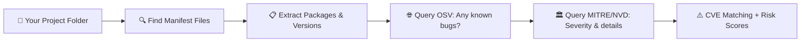
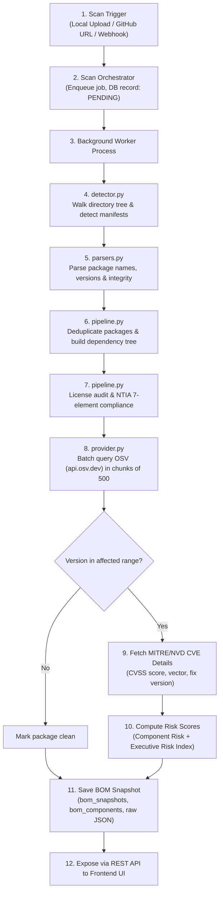

# S-BOM Project Workflow: Scanning, Vulnerability Discovery & Risk Calculation

> A comprehensive, simple yet in-depth guide to how the S-BOM platform scans project folders, parses dependency manifests, queries vulnerability databases (OSV & MITRE), matches CVEs, and calculates risk scores.

---

## Table of Contents

1. [Executive Summary (The 30-Second Mental Model)](#1-executive-summary-the-30-second-mental-model)
2. [High-Level Architecture & Pipeline Overview](#2-high-level-architecture--pipeline-overview)
3. [Phase 1: Scan Triggers & Job Orchestration](#3-phase-1-scan-triggers--job-orchestration)
4. [Phase 2: Project Tree Crawling & Manifest Detection](#4-phase-2-project-tree-crawling--manifest-detection)
5. [Phase 3: Manifest Parsing & Version Normalization](#5-phase-3-manifest-parsing--version-normalization)
6. [Phase 4: Deduplication & Dependency Graph Resolution](#6-phase-4-deduplication--dependency-graph-resolution)
7. [Phase 5: Local Enrichment & NTIA Compliance Audit](#7-phase-5-local-enrichment--ntia-compliance-audit)
8. [Phase 6: Vulnerability Discovery & CVE Matching](#8-phase-6-vulnerability-discovery--cve-matching)
9. [Phase 7: How CVEs and Risk Are Connected & Calculated](#9-phase-7-how-cves-and-risk-are-connected--calculated)
10. [Phase 8: Database Persistence & Dashboard Presentation](#10-phase-8-database-persistence--dashboard-presentation)
11. [Summary Table of Core Files & Responsibilities](#11-summary-table-of-core-files--responsibilities)

---

## 1. Executive Summary (The 30-Second Mental Model)



### The Plain-English Explanation
1. **The scanner does NOT analyze your raw source code for logic bugs.** It performs **Software Composition Analysis (SCA)**.
2. It looks through your project directory for dependency manifest files (e.g., `package-lock.json`, `requirements.txt`, `go.mod`, `pom.xml`).
3. It parses each file to build an exact list of third-party libraries and versions your application relies on (both **direct** and **transitive**).
4. It sends these package names and versions to authoritative open-source vulnerability databases (principally **Google OSV**).
5. If your version falls into a known affected range, it fetches the corresponding **CVE record** and **CVSS score** from **MITRE/NVD**.
6. Finally, it calculates risk scores at both the **component level** and the **project level** using a formula incorporating **CVSS**, real-world exploit probability (**EPSS**), and dependency depth (**Direct vs. Transitive**).

---

## 2. High-Level Architecture & Pipeline Overview



---

## 3. Phase 1: Scan Triggers & Job Orchestration

A scan can be initiated through three primary avenues:

| Trigger | Endpoint | Handler Location | Description |
| :--- | :--- | :--- | :--- |
| **Local Upload** | `POST /api/v1/scans/local` | [server.py](file:///d:/Work_Stuff/Projects/S-BOM/backend/app/api/server.py#L134-L229) | User uploads a `.zip` archive, single manifest, or directory from the frontend UI. The file is extracted to a temporary workspace. |
| **GitHub Repository** | `POST /api/v1/scans/github` | [server.py](file:///d:/Work_Stuff/Projects/S-BOM/backend/app/api/server.py#L231-L285) | User supplies a repository URL and branch/commit. The backend clones the repository into a sandboxed directory. |
| **GitHub Webhooks** | `POST /api/v1/github/webhooks` | [server.py](file:///d:/Work_Stuff/Projects/S-BOM/backend/app/api/server.py#L652-L710) | Automated scan triggered on `push` or `release` event from a connected GitHub repository. |

### Orchestrator Lifecycle
All entry points funnel into [Orchestrator.create_scan()](file:///d:/Work_Stuff/Projects/S-BOM/backend/app/scans/orchestrator.py#L63-L120):
1. **Creates a database entry**: Record created with initial status `PENDING`.
2. **Enqueues the job**: Dispatched to the asynchronous job processing queue.
3. **Executes the pipeline**: Worker thread invokes [Orchestrator.execute()](file:///d:/Work_Stuff/Projects/S-BOM/backend/app/scans/orchestrator.py#L166-L251) which coordinates detection, parsing, vulnerability scanning, and snapshot storage.

---

## 4. Phase 2: Project Tree Crawling & Manifest Detection

**File:** [detector.py](file:///d:/Work_Stuff/Projects/S-BOM/backend/app/scanner/detector.py)

The detector crawls the project folder recursively to identify supported dependency manifest files.

### 4.1 Supported Manifests (~46 Types)
The scanner identifies manifests by name pattern and maps them to language ecosystems:

| Ecosystem | Manifest File(s) | Priority | Description |
| :--- | :--- | :---: | :--- |
| **npm (Node.js)** | `package-lock.json`, `npm-shrinkwrap.json` | 5 | Lockfiles with exact resolved versions and SHA hashes |
| | `yarn.lock`, `pnpm-lock.yaml` | 5 | Yarn / PNPM lockfiles |
| | `package.json` | 1 | Manifest declaring version ranges (`^1.2.0`, `~2.0.0`) |
| **PyPI (Python)** | `poetry.lock`, `Pipfile.lock` | 5 | Pinned lockfiles |
| | `requirements.txt`, `pyproject.toml`, `setup.py` | 1-2 | Dependency lists / package configurations |
| **Go** | `go.sum` | 5 | Checksum file with exact module versions |
| | `go.mod` | 2 | Module definitions |
| **Maven / Gradle (Java/Kotlin)** | `pom.xml`, `build.gradle`, `build.gradle.kts` | 2-3 | Build manifests defining groupId, artifactId, and versions |
| **crates.io (Rust)** | `Cargo.lock` | 5 | Pinned Rust dependencies |
| | `Cargo.toml` | 1 | Crate manifest |
| **RubyGems (Ruby)** | `Gemfile.lock` | 5 | Pinned Gem versions |
| | `Gemfile` | 1 | Gem specification |
| **Packagist (PHP)** | `composer.lock` | 5 | Pinned PHP dependencies |
| | `composer.json` | 1 | PHP composer manifest |
| **NuGet (.NET / C#)** | `packages.lock.json` | 5 | Pinned NuGet dependencies |
| | `*.csproj`, `packages.config` | 1 | Project XML files |

### 4.2 Excluded Paths (Noise Filtering)
To ensure performance and avoid false positives from build artifacts or local installations, the crawler skips:
```
Always Ignored:  .git, .svn, __pycache__, dist, target, build, .idea, .vscode, bin, obj, .next
Vendor/Packages: node_modules, venv, .venv, vendor
```

> **Why skip `node_modules` and virtual environments?**
> The scanner targets what is *declared* and *resolved* by the project's dependency specifications. Scanning nested installed copies causes redundant duplicate packages, severe performance degradation, and distorted dependency hierarchies.

### 4.3 Safety Boundaries
- **Max file size:** `64 MB` per manifest.
- **Max scan units:** `20,000` files maximum traversal limit.
- **Max directory depth:** `30` directory levels deep.

---

## 5. Phase 3: Manifest Parsing & Version Normalization

**File:** [parsers.py](file:///d:/Work_Stuff/Projects/S-BOM/backend/app/scanner/parsers.py)

Each detected manifest is passed to its ecosystem-specific parser to produce structured package components.

### 5.1 Package Data Extraction
For each dependency found, the parser extracts:
- **Name:** e.g., `axios`, `flask`, `com.fasterxml.jackson.core:jackson-databind`
- **Version:** e.g., `0.21.1`, `2.0.1`
- **Ecosystem:** `npm`, `PyPI`, `Maven`, `Go`, `crates.io`, etc.
- **PURL (Package URL):** Standardized package identifier: `pkg:npm/axios@0.21.1`
- **Integrity Hash:** SHA-512 / SHA-256 integrity checksums when present in lockfiles.
- **Dependency Scope:** Direct (declared by application) vs. Transitive (dependency of a dependency).

### 5.2 Version Normalization Logic
Manifest files frequently specify semantic version constraints rather than pinned releases. Vulnerability databases, however, require exact versions to match against affected intervals.

[query_version()](file:///d:/Work_Stuff/Projects/S-BOM/backend/app/vulnerabilities/provider.py#L272-L300) normalizes ranges as follows:

| Raw Specification | Normalized Version | Strategy |
| :--- | :--- | :--- |
| `^1.2.3` | `1.2.3` | Strip caret operator |
| `~2.0.0` | `2.0.0` | Strip tilde operator |
| `>=3.1.0` | `3.1.0` | Extract minimum constraint |
| `1.x` / `1.*` | `1.0` | Resolve wildcard to base version |
| `[1.0, 2.0)` | `1.0` | Use inclusive lower bound |
| `*` / `latest` | *(Ignored)* | Cannot query unpinned wildcards reliably |
| `git+https://...` | *(Ignored)* | Direct repository references bypass package registries |

---

## 6. Phase 4: Deduplication & Dependency Graph Resolution

**File:** [pipeline.py](file:///d:/Work_Stuff/Projects/S-BOM/backend/app/scanner/pipeline.py)

### 6.1 Deduplication ([dedupe()](file:///d:/Work_Stuff/Projects/S-BOM/backend/app/scanner/pipeline.py#L71-L101))
When both a root manifest (e.g., `package.json`) and a lockfile (e.g., `package-lock.json`) exist, the same package may be detected multiple times:
1. Components are grouped by `(name, version, ecosystem)`.
2. Metadata is unified (supplier, licenses, integrity hashes).
3. **Lockfile precedence rule:** Pinned versions and hash checksums from lockfiles override flexible range definitions from manifests.

### 6.2 Dependency Graph Construction ([apply_graph()](file:///d:/Work_Stuff/Projects/S-BOM/backend/app/scanner/pipeline.py#L173-L214))
The scanner organizes components into an explicit dependency tree:

```
Your Application (Root - Depth 0)
├── express@4.18.2          (Depth 1 - DIRECT)
│   ├── body-parser@1.20.1  (Depth 2 - TRANSITIVE)
│   │   └── raw-body@2.5.1  (Depth 3 - TRANSITIVE)
│   └── cookie@0.5.0        (Depth 2 - TRANSITIVE)
└── axios@0.21.1            (Depth 1 - DIRECT)
    └── follow-redirects@1.14.0 (Depth 2 - TRANSITIVE)
```

- **Direct dependencies (Depth 1):** Directly declared in your manifest. You have direct control over these dependencies.
- **Transitive dependencies (Depth >= 2):** Pulled in recursively by your dependencies.
- **Impact on Risk:** Vulnerabilities in direct dependencies have a higher exposure profile than those buried deep in transitive call chains.

---

## 7. Phase 5: Local Enrichment & NTIA Compliance Audit

Still in [pipeline.py](file:///d:/Work_Stuff/Projects/S-BOM/backend/app/scanner/pipeline.py):

### 7.1 Local Metadata Enrichment
- **License Identification:** If omitted in the manifest, the engine inspects local directory licenses (`LICENSE`, `LICENSE.md`, `COPYING`, `NOTICE`) and identifies recognized SPDX expressions (`MIT`, `Apache-2.0`, `BSD-3-Clause`, `GPL-3.0`).
- **PURL Standardization:** Validates or constructs official Package URLs adhering to the PURL specification.
- **Cryptographic Hashes:** Captures SHA-256 and SHA-512 hashes to guarantee software supply chain integrity.

### 7.2 NTIA Minimum Elements Compliance ([audit_compliance()](file:///d:/Work_Stuff/Projects/S-BOM/backend/app/scanner/pipeline.py#L255-L273))
To comply with US Executive Order 14028 and the NTIA Minimum Elements for an SBOM, every component is audited against 7 criteria:

| Check | Required Attribute | Pass Criteria |
| :--- | :--- | :--- |
| `ntia_supplier` | Supplier Identity | Supplier name is present and not `NOASSERTION` |
| `ntia_name` | Component Name | Name is non-empty |
| `ntia_version` | Version String | Version string is explicitly defined |
| `ntia_identifier` | Unique Identifier | PURL or CPE identifier is validly formatted |
| `ntia_relationship` | Dependency Relationship | Designated as Direct or connected in dependency tree |
| `ntia_author` | SBOM Author | Tool / scanner author metadata is populated |
| `ntia_timestamp` | Generation Timestamp | Valid ISO 8601 generation timestamp present |

A component receives a **compliant** status only if all 7 checks pass.

---

## 8. Phase 6: Vulnerability Discovery & CVE Matching

**File:** [provider.py](file:///d:/Work_Stuff/Projects/S-BOM/backend/app/vulnerabilities/provider.py)

The vulnerability engine links packages to known security flaws using **Google OSV** (Open Source Vulnerabilities) and **MITRE / NVD**.

### 8.1 OSV Batch Querying
Extracted packages are grouped into batches of up to 500 components to minimize network overhead:

```http
POST https://api.osv.dev/v1/querybatch
Content-Type: application/json

{
  "queries": [
    { "package": { "name": "axios", "ecosystem": "npm" }, "version": "0.21.1" },
    { "package": { "name": "lodash", "ecosystem": "npm" }, "version": "4.17.20" },
    { "package": { "name": "flask", "ecosystem": "PyPI" }, "version": "2.0.1" }
  ]
}
```

### 8.2 How Version Range Matching Works
OSV records store affected components using semver intervals:

```json
{
  "id": "GHSA-42xw-2xvc-cxqx",
  "aliases": ["CVE-2021-3749"],
  "summary": "Inefficient Regular Expression Complexity in axios",
  "affected": [
    {
      "package": { "name": "axios", "ecosystem": "npm" },
      "ranges": [
        {
          "type": "SEMVER",
          "events": [
            { "introduced": "0" },
            { "fixed": "0.21.2" }
          ]
        }
      ]
    }
  ]
}
```

The matching condition evaluated by the vulnerability engine:
$$\text{introduced} \le \text{project\_version} < \text{fixed}$$

- **`axios@0.21.1`**: $0 \le 0.21.1 < 0.21.2 \implies$ **MATCHED (Vulnerable to CVE-2021-3749)**
- **`axios@0.21.2`**: $0.21.2 \not< 0.21.2 \implies$ **CLEAN (Fix applied)**
- **`axios@1.6.0`**: $1.6.0 \not< 0.21.2 \implies$ **CLEAN**

### 8.3 MITRE & NVD Enrichment
When an OSV vulnerability record contains a CVE alias (e.g., `CVE-2021-3749`), the system queries the MITRE / NVD API:

```http
GET https://cveawg.mitre.org/api/cve/CVE-2021-3749
```

The response is parsed by [_parse_mitre()](file:///d:/Work_Stuff/Projects/S-BOM/backend/app/vulnerabilities/provider.py#L348-L379) to extract:
- **CVSS Base Score:** e.g., `7.5`
- **CVSS Vector:** e.g., `CVSS:3.1/AV:N/AC:L/PR:N/UI:N/S:U/C:N/I:N/A:H`
- **Severity Rating:** `HIGH`
- **Official Summary & Description:** Explains the vulnerability mechanism (e.g., ReDoS in URL parser).
- **Remediation Recommendation:** Fixed version (`0.21.2`).

---

## 9. Phase 7: How CVEs and Risk Are Connected & Calculated

Risk is evaluated hierarchically across three tiers:
1. **CVE Level:** CVSS + EPSS
2. **Component Level:** Worst-case severity
3. **Project Level:** Composite Executive Risk Index (0–10 scale)

### 9.1 The Core Risk Metrics Explained

| Metric | Source | Range | What It Measures |
| :--- | :--- | :---: | :--- |
| **CVSS** *(Common Vulnerability Scoring System)* | MITRE / NVD | $0.0 - 10.0$ | **Theoretical Severity:** Attack complexity, privileges required, and impact on confidentiality, integrity, and availability. |
| **EPSS** *(Exploit Prediction Scoring System)* | FIRST.org | $0.0 - 1.0$ ($0\% - 100\%$) | **Real-World Threat Probability:** The probability that a CVE will be exploited in the wild within the next 30 days. |
| **Scope Multiplier** | S-BOM Graph | $1.0$ or $0.5$ | **Architectural Exposure:** Direct dependencies = `1.0`; Transitive dependencies = `0.5`. |

---

### 9.2 Component-Level Risk
In [AppStateContext.tsx](file:///d:/Work_Stuff/Projects/S-BOM/frontend/src/context/AppStateContext.tsx#L70-L83), a component's assigned risk category is dictated by the **highest severity** among all CVEs matched against it:

$$\text{Component Risk} = \max(\text{Severity of all matched CVEs})$$

| Highest CVE Severity | CVSS Score Range | Assigned Component Risk Badge |
| :--- | :---: | :--- |
| None | $0.0$ | **Safe** (Green) |
| Low | $0.1 - 3.9$ | **Low** (Blue) |
| Medium | $4.0 - 6.9$ | **Medium** (Yellow) |
| High | $7.0 - 8.9$ | **High** (Orange) |
| Critical | $9.0 - 10.0$ | **Critical** (Red) |

---

### 9.3 Project-Level Categorical Health
In [dashboard.py `_risk()`](file:///d:/Work_Stuff/Projects/S-BOM/backend/app/projects/dashboard.py#L198-L203), the overall project status badge is determined by threshold rules:

```python
if any_critical_cves:
    return "High Risk"           # 🔴 Red badge
elif any_high_cves or total_cves >= 5:
    return "Needs Attention"    # 🟡 Amber badge
else:
    return "Healthy"            # 🟢 Green badge
```

---

### 9.4 Executive Risk Index Formula (0 – 10.0 Scale)
As defined in [Policies.tsx](file:///d:/Work_Stuff/Projects/S-BOM/frontend/src/pages/compliance/Policies.tsx#L108-L116), the project-wide composite score uses a logarithmic dilution model:

$$\text{Risk Index} = \min\left(10.0, \frac{\sum_{i=1}^{N} \Big[\text{CVSS}_i \times (1.0 + \text{EPSS}_i) \times \text{ScopeMultiplier}_i\Big]}{\log_2(\text{Total Components} + 2)}\right)$$

#### Why is the formula designed this way?
1. **$\text{CVSS} \times (1.0 + \text{EPSS})$:** Combines theoretical impact with empirical exploit activity. A CVSS 8.0 vulnerability with active exploits ($\text{EPSS} = 0.90$) weighs as $8.0 \times 1.90 = 15.2$, whereas an unexploited CVE ($\text{EPSS} = 0.02$) weighs as $8.0 \times 1.02 = 8.16$.
2. **$\text{ScopeMultiplier}$:** Direct dependencies ($1.0$) carry full weight because they sit directly in your application code. Transitive dependencies ($0.5$) receive half weight due to intermediate isolation.
3. **$\log_2(\text{Total Components} + 2)$:** Applies logarithmic normalization. A project with 2,000 dependencies and 2 vulnerabilities is substantially less risky as a whole than a micro-service with 5 dependencies and 2 vulnerabilities.

#### Step-by-Step Calculation Example
Suppose a repository has **100 total components** and **3 discovered CVEs**:

| Vulnerability ID | CVSS | EPSS | Scope | Calculation | Weighted Score |
| :--- | :---: | :---: | :---: | :--- | :---: |
| **CVE-2021-3749** | 7.5 | 0.15 | Direct ($1.0$) | $7.5 \times (1 + 0.15) \times 1.0$ | **8.625** |
| **CVE-2023-1234** | 9.8 | 0.85 | Direct ($1.0$) | $9.8 \times (1 + 0.85) \times 1.0$ | **18.130** |
| **CVE-2022-5678** | 4.3 | 0.02 | Transitive ($0.5$) | $4.3 \times (1 + 0.02) \times 0.5$ | **2.193** |

$$\text{Sum of Weighted CVEs} = 8.625 + 18.130 + 2.193 = 28.948$$
$$\text{Divisor} = \log_2(100 + 2) = \log_2(102) \approx 6.672$$
$$\text{Risk Index} = \min\left(10.0, \frac{28.948}{6.672}\right) = \min(10.0, 4.338) = \mathbf{4.34} \quad (\text{Medium Risk})$$

---

## 10. Phase 8: Database Persistence & Dashboard Presentation

**Files:** [store.py](file:///d:/Work_Stuff/Projects/S-BOM/backend/app/repositories/store.py), [server.py](file:///d:/Work_Stuff/Projects/S-BOM/backend/app/api/server.py)

### 10.1 Database Schema Representation

```sql
-- Main snapshot record
CREATE TABLE bom_snapshots (
    id VARCHAR(36) PRIMARY KEY,
    organization_id VARCHAR(36) NOT NULL,
    project_id VARCHAR(36) NOT NULL,
    scan_id VARCHAR(36) NOT NULL,
    scanner_name VARCHAR(100),
    scanner_version VARCHAR(50),
    generated_at TIMESTAMP NOT NULL,
    raw_metadata JSON -- Stores scan options, vulnerability_matches list
);

-- Individual components extracted
CREATE TABLE bom_components (
    id VARCHAR(36) PRIMARY KEY,
    snapshot_id VARCHAR(36) REFERENCES bom_snapshots(id),
    name VARCHAR(255) NOT NULL,
    version VARCHAR(100) NOT NULL,
    ecosystem VARCHAR(50) NOT NULL,
    purl VARCHAR(500),
    license VARCHAR(100),
    supplier VARCHAR(255),
    direct_dependency BOOLEAN DEFAULT TRUE,
    risk VARCHAR(20) DEFAULT 'Safe', -- 'Safe' | 'Low' | 'Medium' | 'High' | 'Critical'
    cve_count INTEGER DEFAULT 0,
    raw JSON -- Stores NTIA checklist, hashes, vulnerability details, tree depth
);
```

### 10.2 API Endpoints Serving the UI

| REST Endpoint | Purpose | Target UI View |
| :--- | :--- | :--- |
| `GET /api/v1/projects` | Project lists with risk badge & vulnerability counts | Dashboard & Project Overview |
| `GET /api/v1/scans/{id}/components` | Complete Bill of Materials with licenses, PURLs, and risk status | Software Inventory page |
| `GET /api/v1/scans/{id}/vulnerabilities` | Detailed CVE list, CVSS scores, vectors, and remediation advisories | Vulnerability Management page |
| `GET /api/v1/scans/{id}/compliance` | NTIA 7-element compliance breakdown | Regulatory Compliance page |
| `GET /api/v1/scans/{id}/export?format={spdx|cyclonedx}` | Generates standard SPDX 2.3 or CycloneDX 1.5 SBOM files | Export Center |

---

## 11. Summary Table of Core Files & Responsibilities

| Subsystem | Source File | Core Functions & Responsibilities |
| :--- | :--- | :--- |
| **API Server** | [server.py](file:///d:/Work_Stuff/Projects/S-BOM/backend/app/api/server.py) | Exposes `/api/v1/scans/*`, receives uploads, clones Git repos, handles webhooks. |
| **Scan Orchestrator** | [orchestrator.py](file:///d:/Work_Stuff/Projects/S-BOM/backend/app/scans/orchestrator.py) | Manages job lifecycle (`PENDING` $\to$ `RUNNING` $\to$ `COMPLETED`), triggers scanner. |
| **Manifest Detection** | [detector.py](file:///d:/Work_Stuff/Projects/S-BOM/backend/app/scanner/detector.py) | Crawls directory tree, identifies ~46 manifest types, applies ignore filters. |
| **Manifest Parsers** | [parsers.py](file:///d:/Work_Stuff/Projects/S-BOM/backend/app/scanner/parsers.py) | Parses npm, PyPI, Maven, Go, Cargo, NuGet manifests and extracts package specs. |
| **Pipeline & Graph** | [pipeline.py](file:///d:/Work_Stuff/Projects/S-BOM/backend/app/scanner/pipeline.py) | Deduplicates components, builds dependency hierarchy, audits NTIA compliance. |
| **Vulnerability Provider** | [provider.py](file:///d:/Work_Stuff/Projects/S-BOM/backend/app/vulnerabilities/provider.py) | Queries OSV in batches, matches affected version intervals, enriches with MITRE/NVD. |
| **Database Repository** | [store.py](file:///d:/Work_Stuff/Projects/S-BOM/backend/app/repositories/store.py) | Persists snapshots and components to SQL tables. |
| **Dashboard Analytics** | [dashboard.py](file:///d:/Work_Stuff/Projects/S-BOM/backend/app/projects/dashboard.py) | Calculates overall project risk status and health categorization. |
| **Frontend State & Policies** | [AppStateContext.tsx](file:///d:/Work_Stuff/Projects/S-BOM/frontend/src/context/AppStateContext.tsx)<br>[Policies.tsx](file:///d:/Work_Stuff/Projects/S-BOM/frontend/src/pages/compliance/Policies.tsx) | Computes component risk badges and executes the Executive Risk Index formula. |
